# Lab 0: ARMv8 Development environment setup

Unfortunately, we do not have any ARMv8 chips, so we must rely on an ARM Fixed Virtual Platform (FVP).
Essentially this software will emulate an ARMv8 chip, allowing us to program in the ISA we have studied in class.

This lab shows you how to setup Dev Studio one your own machines or using Method 2 on the lab machines.
**You are only required to demo one of the methods for this lab. Although we recommend you get Dev Studio working on your own computer**.

- [Lab 0: ARMv8 Development environment setup](#lab-02-armv8-development-environment-setup)
- [Method 1 ARM Dev Studio](#method-1-arm-dev-studio)
  - [ARM Development Studio IDE installation](#arm-development-studio-ide-installation)
    - [Windows](#windows)
    - [Linux](#linux)
  - [ARM Development Studio License](#arm-development-studio-license)
  - [Example program setup Dev Studio](#example-program-setup-dev-studio)
    - [Creating a project in ARM Development Studio](#creating-a-project-in-arm-development-studio)
    - [Adding and compiling source file `main.S`](#adding-and-compiling-source-file-mains)
    - [Configuring the debugger](#configuring-the-debugger)
    - [Launching debugger with FVP](#launching-debugger-with-fvp)
    - [Debugging `main.S` step-by-step](#debugging-mains-step-by-step)
  - [Further guides](#further-guides)
- [[100 Points] Lab 0 Sanity Quiz](#100-points-lab-02-sanity-quiz)
  - [Questions](#questions)
    - [[30 Points] Question 1](#30-points-question-1)
    - [[30 Points] Question 2](#30-points-question-2)
    - [[40 Points] Question 3](#40-points-question-3)
  - [Errata](#errata)

# Method 1 ARM Dev Studio

<!-- ## Prerequisites

1. An PC with Windows or Linux installed and 5GB+ free space
2. An ARM Developer account
   1. If you have an ARM developer account, you could directly skip to [IDE installation section](#arm-development-studio-ide-installation) -->

<!-- 
Not needed since we have a license server
## ARM Developer account registration

1. Go to the [ARM developer website](https://developer.arm.com/)
2. Click on account icon on top right and select `Register`

    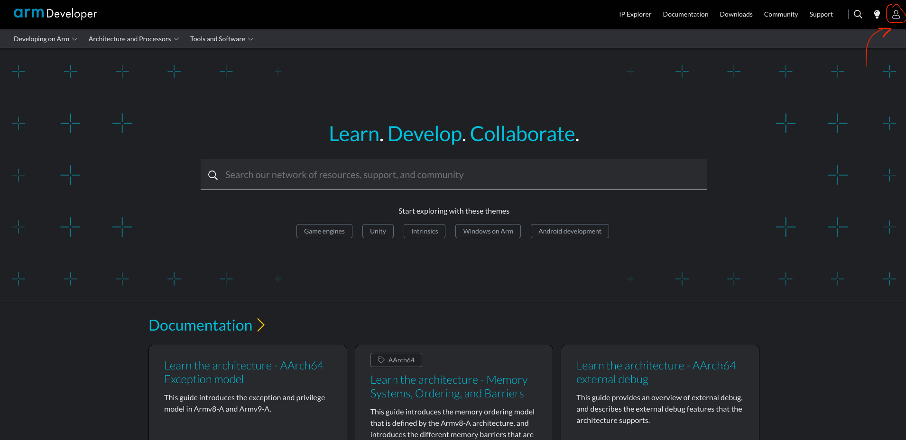

3. Enter your Purdue email address in the dialog and proceed with `Send verification code`
4. Enter the verification code sent to your email and proceed with `Verify code`.
   1. You might need to check spam filter or wait 1~2 minutes for the email to arrive.
5. In the new webpage, proceed by entering your information. You will need your email address and password to activate the ARM Developer Studio.

    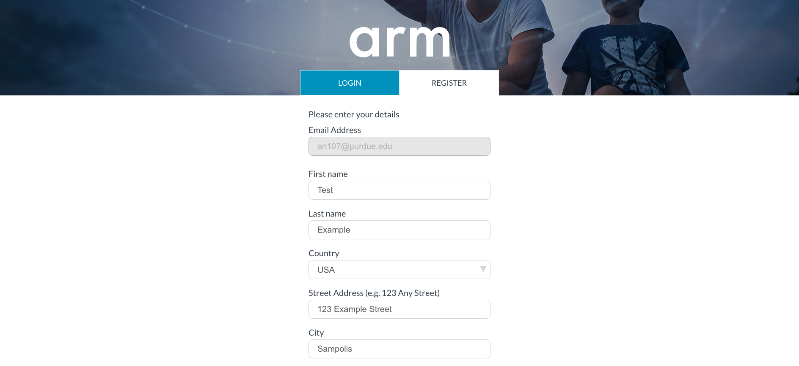

6. Hit `Create` and you should be able to login into your ARM account. -->

## ARM Development Studio IDE installation

1. You don't need to install the IDE on lab machines; they are already pre-installed.
2. ARM Development Studio IDE requires a Windows or Linux PC. If you hold a Mac machine, please refer to the Lab machine to use this software.
3. Visit the [ARM Developer Studio website](https://developer.arm.com/downloads/-/arm-development-studio-downloads) to download the newest IDE.
4. After the download completes, please go to the section corresponding to your PC operating system and proceed with the remaining steps:
   1. [Windows PC](#windows)
   2. [Linux PC](#linux)

### Windows

1. After the download completes, locate the downloaded zipped file with name similar to `DS000-BN-00000-r22p1-00rel.zip`
2. Extract the file content by right clicking the file and select `Extract All`, then select a folder you want the contents in the file to be placed:
    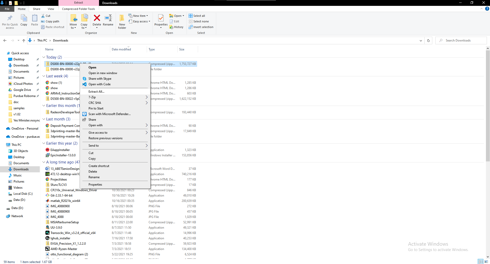
3. In the extracted files folder, open the `armds-2022.1.exe` setup program (the numeric postfix might be different for different versions)
4. In the setup program, proceed by continuously hitting the `Next` button
   1. You could also specified a location to install the IDE (the default location is `C:\Program Files\Arm\Developement Studio 2022.1\`):
    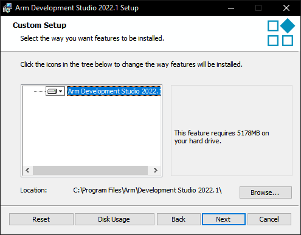
   2. You will need admin privilege to install the IDE and its driver.
   3. The installation might take 2~3 mins to complete
5. You are done! You could find the IDE in the Start menu or by searching `Arm DS IDE 2022.1` in the Windows search bar.
    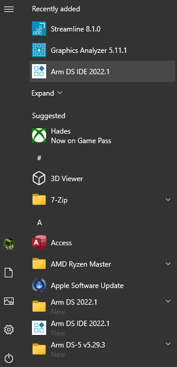
6. Now you should refer to the [license section](#arm-development-studio-license-tbd) to activate the IDE

### Linux

> Note: the guide for Linux is tested on Ubuntu 16.04, other Linux distro should also work fine

1. After the download completes, locate the downloaded compressed file with name similar to `DS000-BN-00001-r22p1-00rel0.tgz`
2. Extract the file to `~/Desktop/ARM-DS` and install the IDE:

    ```bash
    # Create the directory '~/Desktop/ARM-DS'
    # and extract all files to it
    # Note the compressed file name might be different
    mkdir -p ~/Desktop/ARM-DS && tar -xvf DS000-BN-00001-r22p1-00rel0.tgz -C ~/Desktop/ARM-DS

    # Enter the install file dir
    cd ~/Desktop/ARM-DS/DS000-BN-00001-r22p1-00rel0/
 
    # Ensure we can execute the shell script
    chmod u+x armds-2022.1.sh

    # Run the installation script, need sudo to install
    #   USB drivers
    # This will install the ARM Development Studio 
    #   to '/opt/arm/developmentstudio-2022.1'
    # If you want to modify the installation path, 
    #   remove the '--no-interactive flag' or 
    #   supply your custom path after the '-d'
    #   flag
    sudo ./armds-2022.1.sh --i-agree-to-the-contained-eula --no-interactive
    ```

3. After installation, you could find the IDE by searching `Arm DS IDE 2022.1` in Ubuntu search bar or by running `/opt/arm/developmentstudio-2022.1/bin/armds_ide` from terminal (you will need to change the `/opt/arm/developmentstudio-2022.1` prefix if you have it installed on custom path).
4. Now you should refer to the [license section](#arm-development-studio-license-tbd) to activate the IDE

## ARM Development Studio License

We will use a license server within Purdue to gain IDE access. This license will work both on lab machines as well as your personal machines provided you are connected to Purdue network (i.e. PAL 3.0 or Purdue VPN).

> Note: for connecting to Purdue VPN, see [this guide](https://www.itap.purdue.edu/connections/vpn/) from ITAP.

> Note: also you might need a VPN connection even with PAL 3.0.

In the ARM DS IDE, opens up the license manager from top menu under `Help->Arm License Manager...`: 

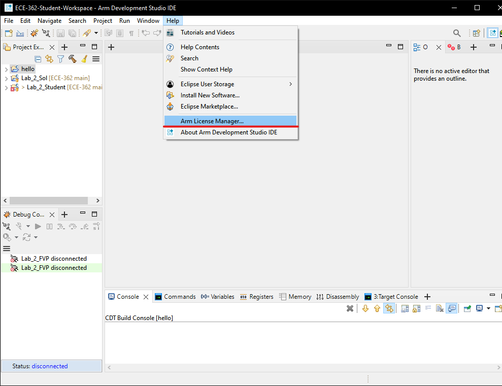

Then, in the popped up window, select `Change`:

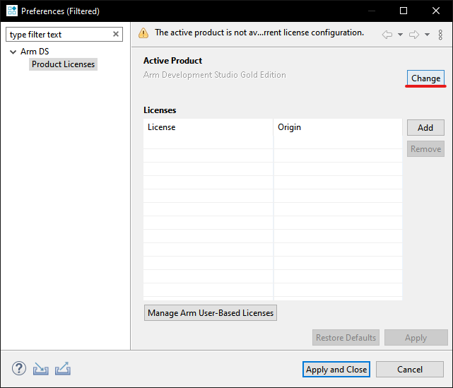

> You might also want to remove any previous evaluation license as well.

> If you do not see the `Change` button, just click on the `Configure` button instead.

Then select `Add product license` and hit `Next`:

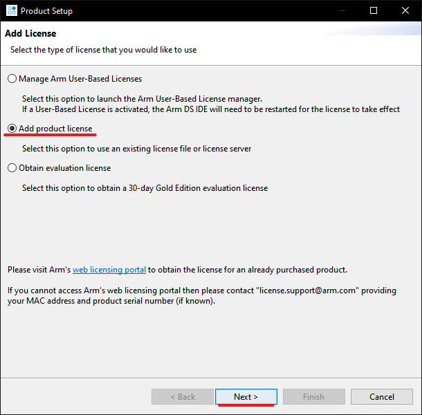

Select `License Server` and enter the following: `8224@marina.ecn.purdue.edu`:

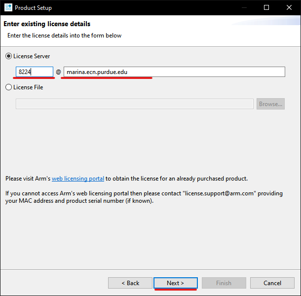

Keep hitting `Next` until this page shows up, then click `Finish`:

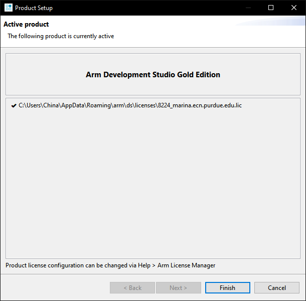

Click `Apply & Close`, your ARM DS IDE should be set up properly.

<!--
All of these are the evaluation license 
> Note: this section is perform under the Linux version of the IDE, there might exist minor differences with the Windows one, but will not affect the final outcome.

In this section we will obtain an evaluation license for the ARM Development Studio (we are currently working on getting educational licenses from ARM, but for the first lab, we will be using the trial version).

1. First open up your newly installed ARM DS (you could find it by searching `ARM Development Studio` in the system search bar)
2. For the first time you open the IDE, a license prompt will pop up to let you choose the license type, select `Obtain evalution license` as shown below and hit `Next`:

    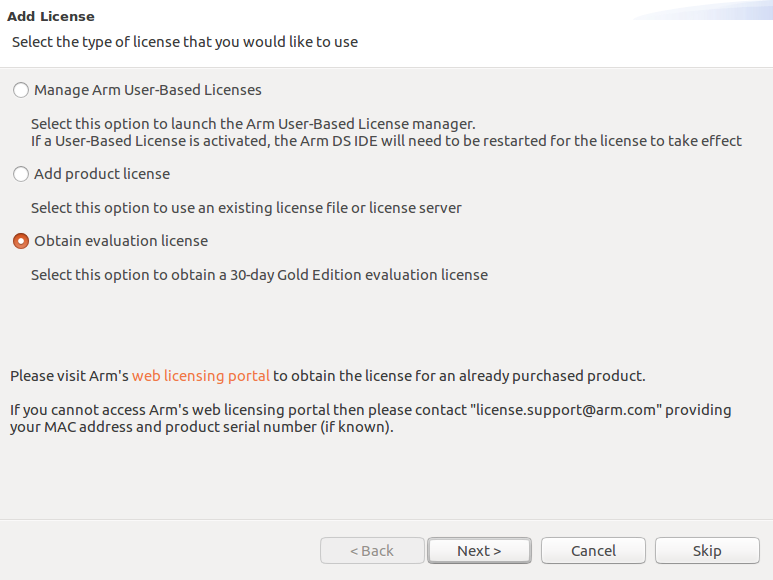
3. Enter your ARM account email and password, then hit `Next`
4. Select one of your network interface as the license will need it to recognize the computer, then hit `Next`:

    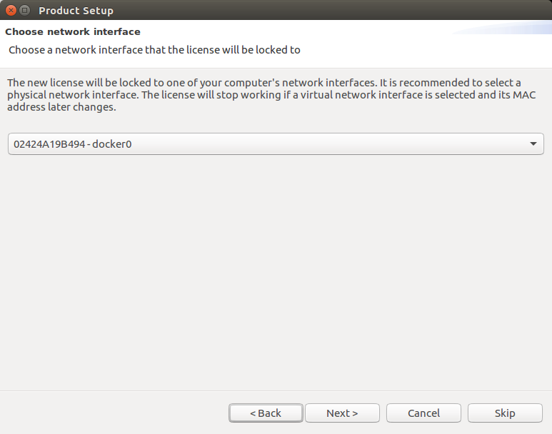

5. You should see the license file being generated properly and installed on your local machine, hit `Next` and then `Finish` to complete the setup

    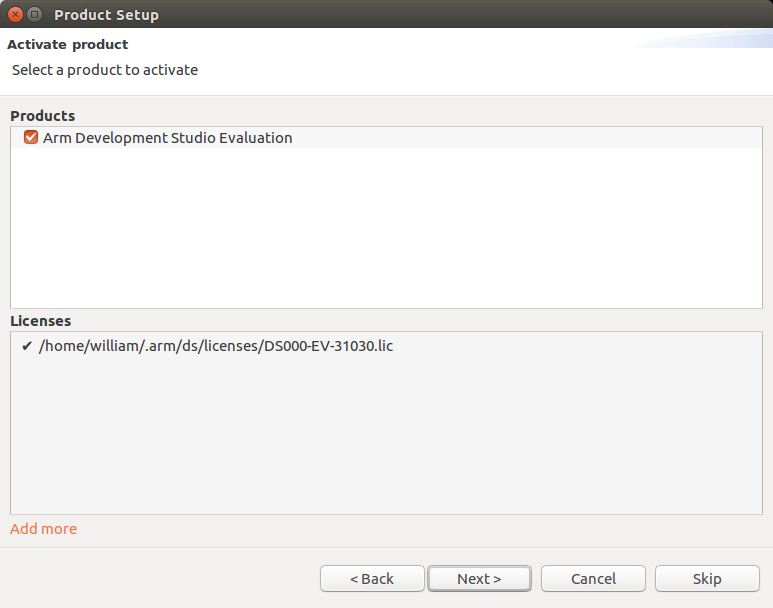

6. You are now ready to use the ARM Development Studio to create your first assembly program! -->

## Example program setup Dev Studio

> Note: this section is perform under Windows version of the IDE, there might exist minor differences with the Linux one, but will not affect the final outcome.

> Note: this section is partially based on the [ARM Development Studio Getting Started Guide](https://developer.arm.com/documentation/101469/2000/Tutorials/Tutorial--Hello-World).

In this section, we will be using the ARM Development Studio (ARM DS) IDE to write a simple assembly program and debug with ARM FVP simulation model.

### Creating a project in ARM Development Studio

1. Open the ARM Development Studio and ensure you are in the Development Studio Perspective similar to the following:
    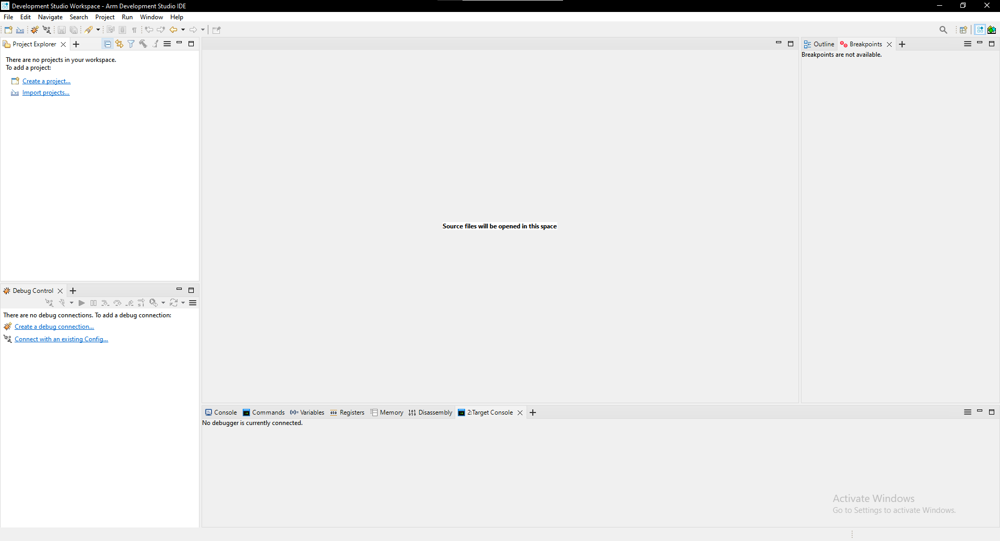
    1. You might have the center portion displaying information about the IDE.
    2. If you do not have this, you could select the Developement Studio perspective by clicking the following highlighted icon on the top right corner:
        
        1. Starting from the left to right, the first icon, search, allows you to search for content within the IDE
        2. The second icon allows you to choose from various perspectives
        3. The third one allows you to directly switch to development view
        4. The final one is used to install chip-specific packages and won't be used in this lab.
2. In the Development Perspective, create a new C project by navigating `File->New->Project` on the top menu bar

    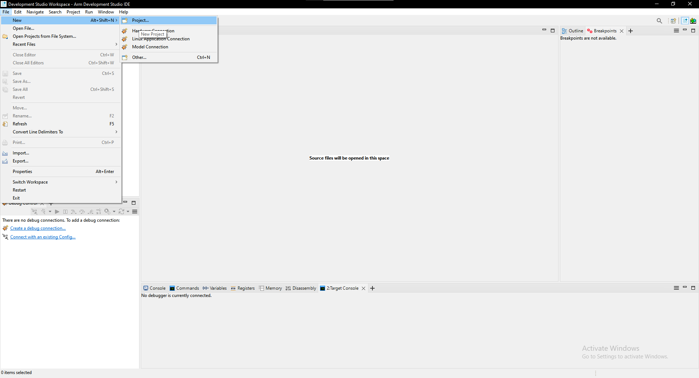

3. In the popped up windows, select `C/C++/C Project` and hit `Next`

    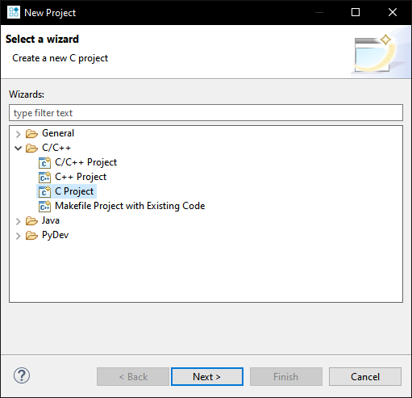

4. Let's give this project a name `HelloWorld` and select the `Empty Project` option

    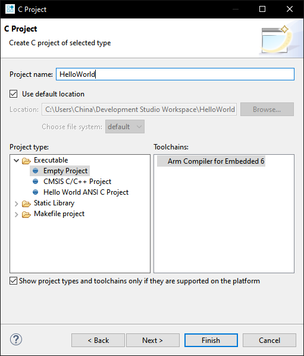

5. Click `Finish` to skip rest of the configuration

### Adding and compiling source file `main.S`

1. Right click on the project folder and select `New->File`:

    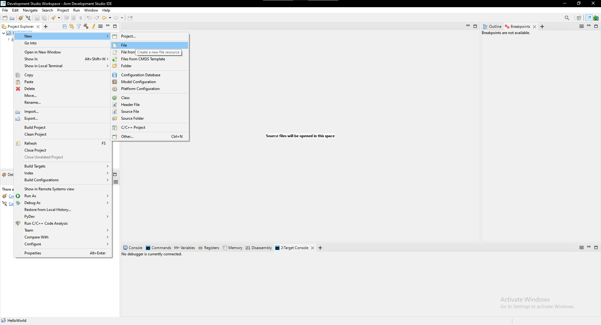

2. In the popped up window, give the file a new name `main.S` and hit `Finish`

    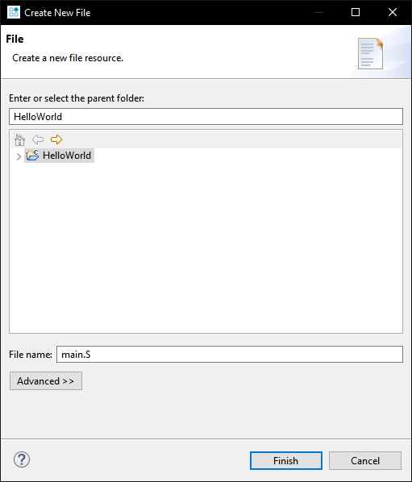

3. In the created `main.S` file, copy the following simple assembly program to it:

    ```asm
    // Mark the 'main' label as visible to linker
    // meaning other program can call this function
    .global main

    // the main function
    // assign register x0 with val 1
    // assign register x1 with val 2
    // add x0 and x1 and assign value to register x2
    // return to address in register 'lr'
    //     (ignore the following screenshots with 'blr lr')
    main:
        mov x0, #1
        mov x1, #2
        add x2, x0, x1
        ret lr
    ```

4. Before we build the project, we will need to set the RAM base address for our FVP target so that it will properly run our test program
    1. Right click on the project name in the `Project Explorer` and select `Properties`

        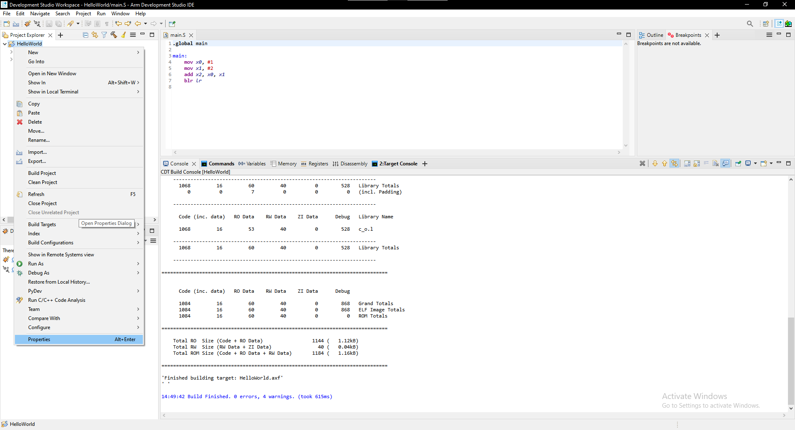

    2. In the popped window, select `C/C++ Build -> Setting -> Arm Linker 6 -> Image Layout`. In the `RO base address`, enter `0x80000000`

        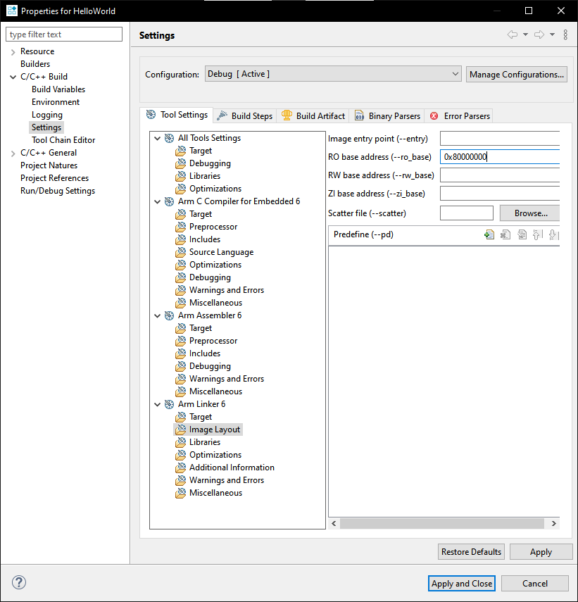

    3. Hit `Apply and Close` to finish this step
5. Now we will compile/build the project
    1. You could build the project by clicking the littler hammer icon on top of the `Project Explorer` tab

        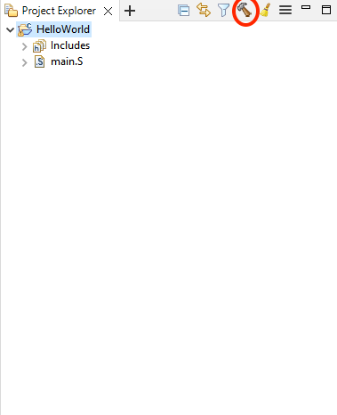

        1. If the icon is grey, make sure you have selected the project
    2. Or by using the shortcut `ctrl-B`
6. After the compiliation, in the console window at the bottom of the IDE, you should see outputs similar to:

    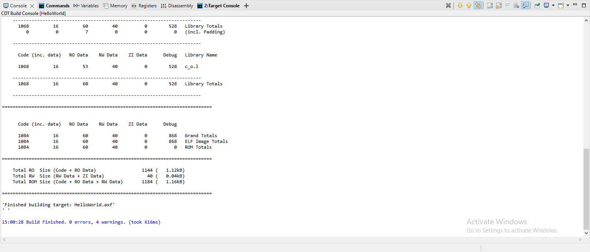

    1. `*.axf` is an ARM exectuable format, similar to `.elf`
7. Good job! Now you have an ARM exectuable that is ready to run on a simulator!

### Configuring the debugger

1. On top of `Project Explorer` tab, click the `New Debug Connection` icon

    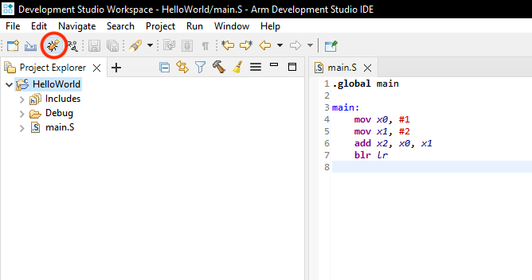

2. Select `Model Connection` in the popped up window, hit `Next`

    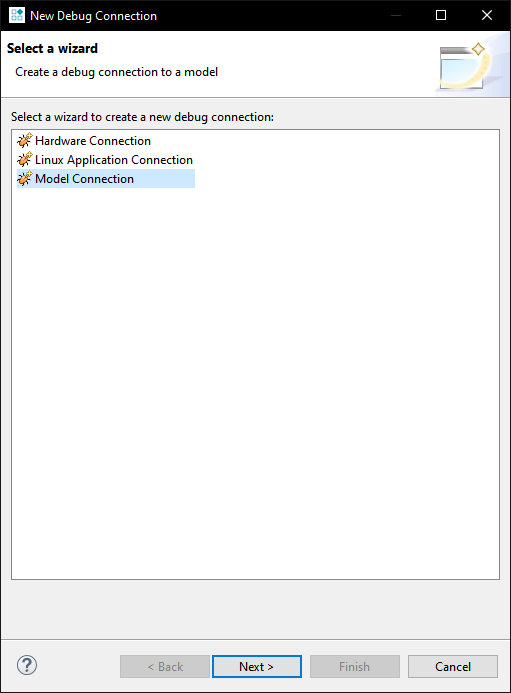

3. Enter an descriptive name for the debug connection and associate it with our project, hit `Next`

    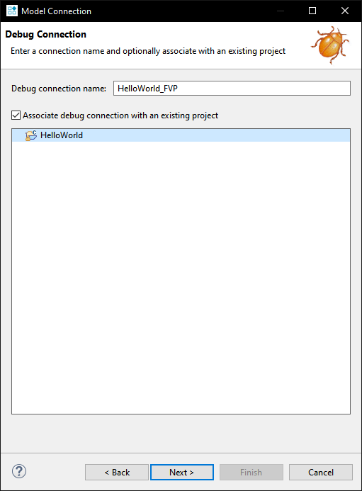

4. Expand `Arm FVP (Installed with Arm DS)` and select `Base_A57x1` as our FVP model (an ARMv8-A core), hit `Finish`

    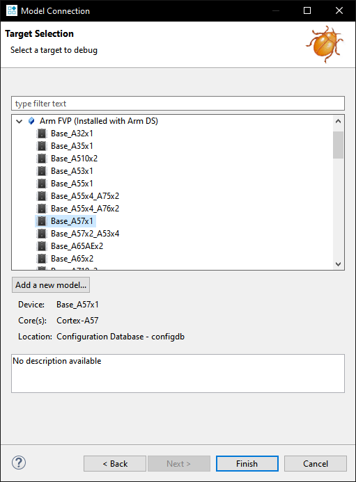

5. After adding the model connection, you should see a pop up window titled with `Edit configuration and launch`
6. In the `Bare Metal Debug` dialog located at the lower half of the window, enter `-C bp.secure_memory=false` as the model parameter

    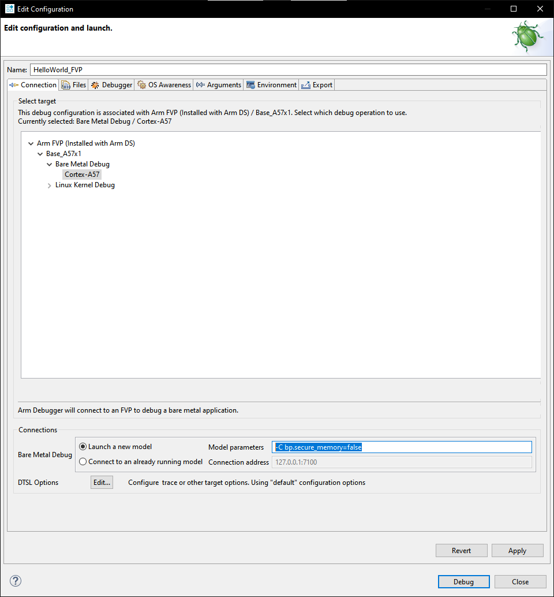
    - According to ARM:
        > This parameter disables the TZC-400 TrustZone memory controller included in the Base_A53x1 FVP. By default, the memory controller refuses all accesses to DRAM memory.
    - Although we are using A57, this step is still necessary to correctly debug the FVP
7. In the same window, select the `Files` tab
    1. In the `Target Configuration` dialog, click `Workspace...`
    2. Select the `HelloWorld.axf` under `Debug` folder
    3. Hit `OK`

    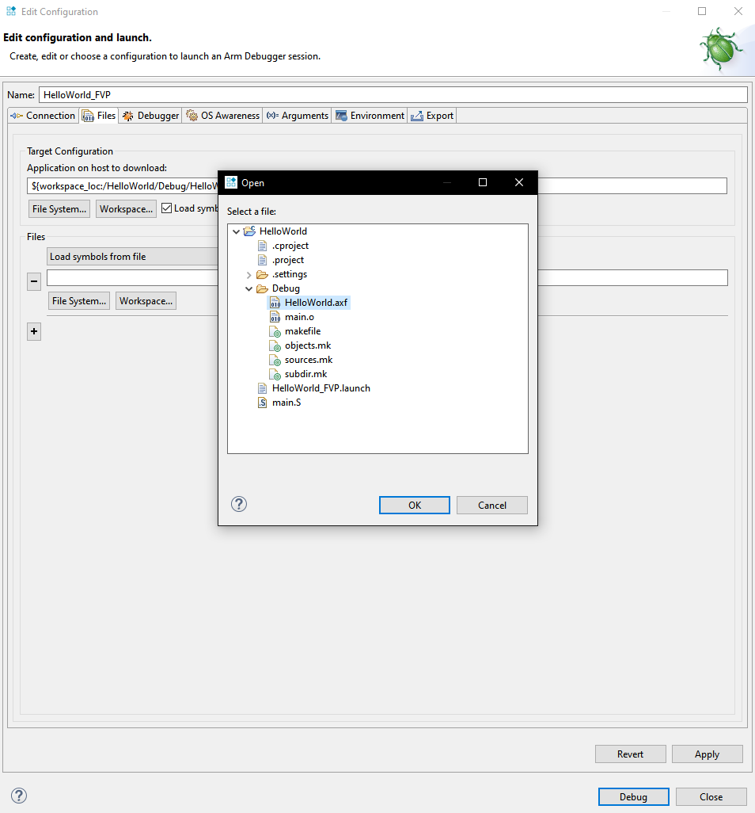
8. Again in the `Edit configuration and launch` window, select the `Debugger` tab
    1. Under `Run control`, select `Debug from symbol` option
    2. Also make sure the input box after the option has `main`
    3. This will allow the debugger to stop at the `main` function

    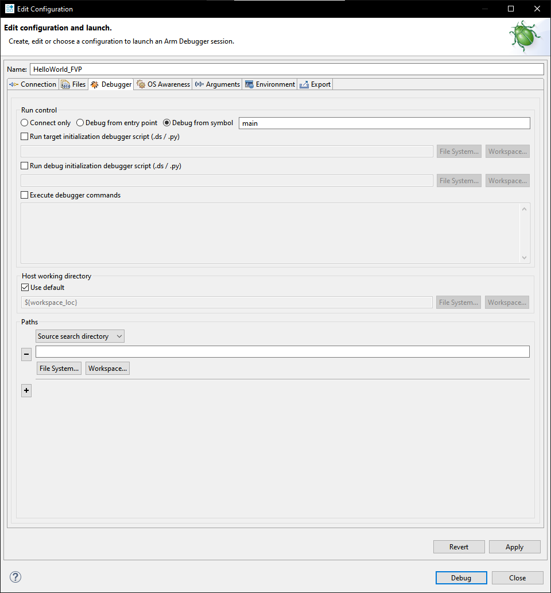

9.  Hit `Apply` to save all changes
10. Now you are ready to debug! You could always reconfigure all this by opening the file `HelloWorld_FVP.launch` or by right clicking the project name and navigate to `Debug As -> Debug Configurations...`

### Launching debugger with FVP

> Note: if you launch the IDE from the application page, and encounter issues when launching the debugger, try close the IDE and launch from terminal using the commands below:
> ```
> # Opens up a terminal, copy and run the following commands
> ml armds
> armds_ide
> ```

1. To start debugging, you could either
   1. Hit the `Debug` button when configuring the debugger
   2. Or by clicking the `*.launch` debug configuration file and hit `Debug` in the pop-up window
   3. Or by right clicking the project name and select `Debug As -> Arm Debugger...`
   4. Or by right clicking the debugging connection target `HelloWorld_FVP` in the `Debug Control` window on the bottom left and then select `Connect to Target`

        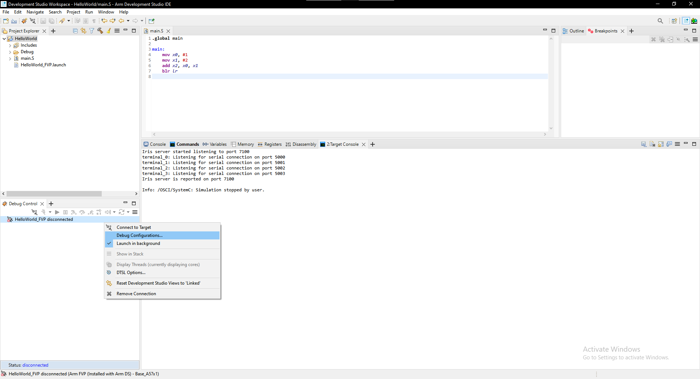

2. After the debugging started, you will see a black window popped up and the program stop at `mov x0, #1`
    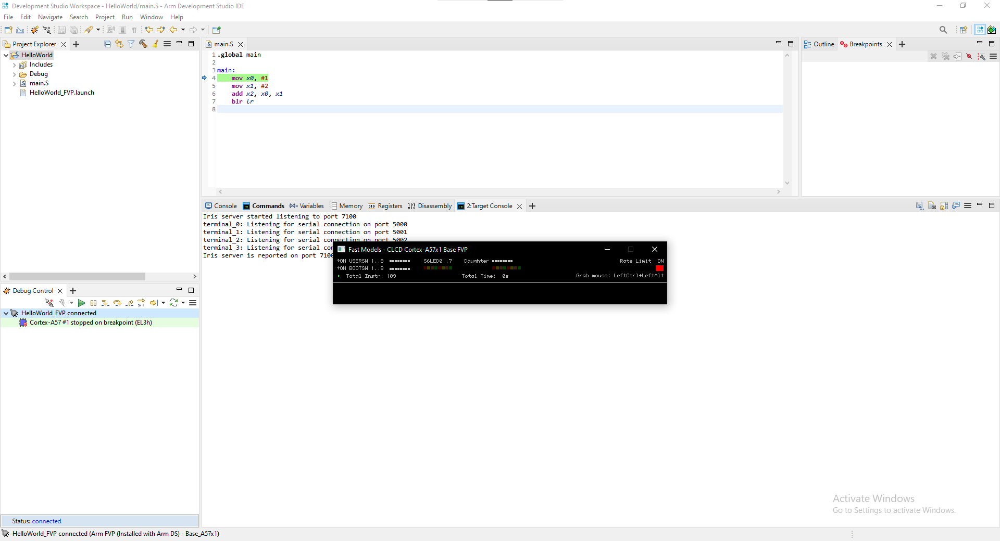
    1. The black window is our FVP model, you can ignore it by minimize it
    2. If your program does not pause at `mov x0, #1`, please check your previous steps on adding the source file and configuring debugger
       1. Especially on setting the RAM base address
       2. And the model parameter for FVP
3. During the debugging process, there are multiple tabs at the bottom
    1. `Console`
       1. View the Build messages
       2. Won't be used for debugging
    2. `Commands`
       1. Display commands sent to debugger
       2. Allow you to send debug commands from text
    3. `Variables`
       1. Show the variables in the source file and their values
       2. But since this is a simple assembly program, nothing will display here
    4. `Memory`
       1. Allow you to read from a memory address and dump the contents
       2. We will not use it in this lab
    5. `Registers`
       1. Display values of the registers
       2. We will only focus on the core register presented in AArch64, i.e. those under `AArch64/Core`
            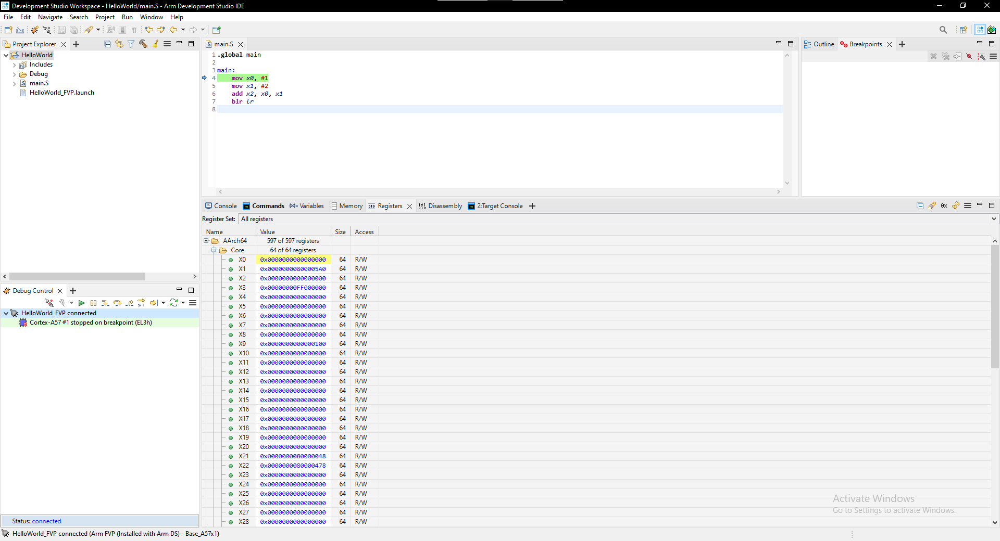
    6. `Disassembly`
       1. Display the assembly code that corresponds to the program
       2. In addition to the simple `main` function we coded, you will see other segments of assembly code related to initialization, interrupt setup, and program exit
            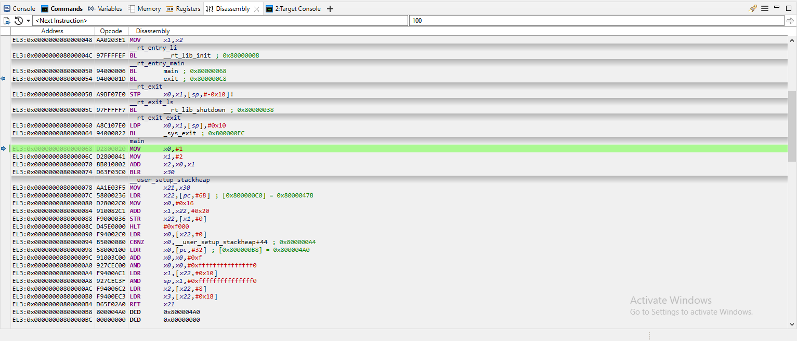
    7. `Target Console`
       1. Display communication logs with the FVP model, do not worry about it
    8. You could drag the tabs to the edge and view them side by side.

### Debugging `main.S` step-by-step

1. To step the program, click the `Step Source Line` icon under the `Debug Control` tab or press `F5`

    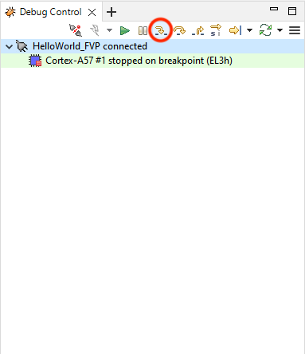

2. First step: register `x0` should have value `1` loaded

    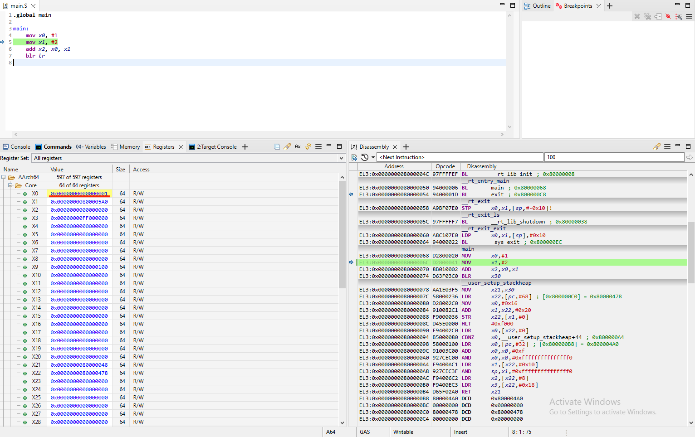

3. Second step: register `x1` should have value `2` loaded

    

4. Third step: register `x2` should have value `3` loaded

    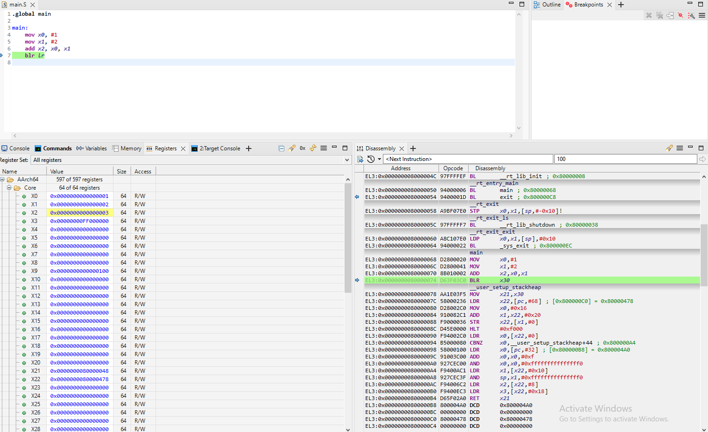

5. Hooray! You have finished debugging an assembly program that runs with ARM instructions!
6. To end the debugging session, click the `Disconnect from Target` button

    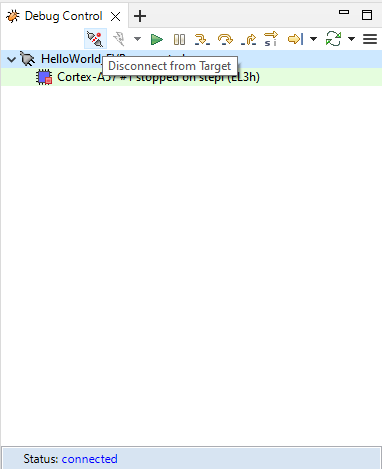

## Further guides

1. [ARM Development Studio Tutorial: Hello World](https://developer.arm.com/documentation/101469/2000/Tutorials/Tutorial--Hello-World?lang=en)
2. [ARM Development Studio IDE Introduction](https://developer.arm.com/documentation/101469/2000/Introduction-to-the-Integrated-Development-Environment)
3. [ARM Development Studio Debugger Introduction](https://developer.arm.com/documentation/101469/2000/Tutorials/Tutorial--Hello-World/Application-debug-with-Arm-Debugger?lang=en)

# [100 Points] Lab 0 Sanity Quiz

A simple quiz to test basic debugger usage.

Copy the following code into the `lab0.S` of lab 0, use debugger to find answers to the 3 questions down below.

```asm
.global main
main:
    ldr x0, =0xABCDBEEFBAD1BAD0
    ldr x1, =0xEE10ACBD22433900
    ldr x2, =0x87874838217384FF

question_1:
    add x3, x0, x1

question_2:
    and x4, x0, x2
    eor x4, x4, x1

question_3:
    neg x5, x0
    orr x5, x5, x1
    and x5, x5, x2
    add x5, x5, x0

    ret
```

## Questions

You must demo these results in the debugger to collect these points.

### [30 Points] Question 1

What is the value inside register `x3` when the program runs to the end of `question_1`? I.e. after line 8 `add x3, x0, x1`?

### [30 Points] Question 2

What is the value of register `x4` when the program runs to the end of `question_2`? I.e. after line 12 `eor x4, x4, x1`?

### [40 Points] Question 3

What is the value of register `x5` when the program runs to the end of `question_3`? I.e. after line 17 `add x5, x5, x0`?


## Errata

1. Several screenshots have `blr lr` instead of `ret lr` as return to caller function.
