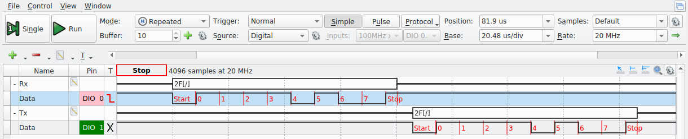
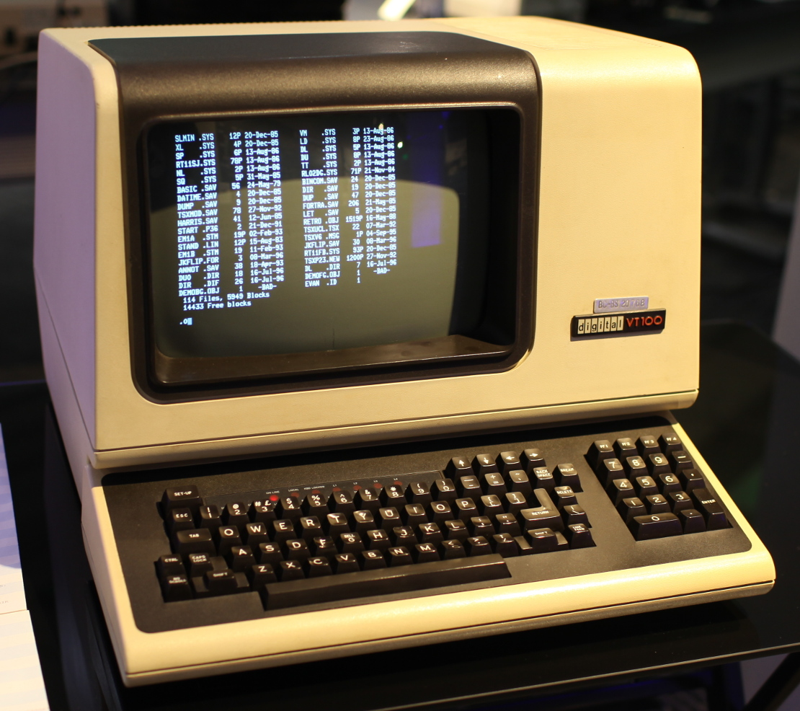

# Lab 7: USART
<!--
- [Lab 11: UART](#lab-11-uart)
  - [1. Introduction](#1-introduction)
  - [2. Instructional Objectives](#2-instructional-objectives)
  - [3. Background](#3-background)
    - [3.1 Asynchronous Serial Communication](#31-asynchronous-serial-communication)
    - [3.2 STM32 USART Peripheral](#32-stm32-usart-peripheral)
    - [3.3 Viewing an asynchronous serial transaction](#33-viewing-an-asynchronous-serial-transaction)
    - [3.4 Using a serial terminal emulator program](#34-using-a-serial-terminal-emulator-program)
  - [(100 points) 4. Experiment](#100-points-4-experiment)
    - [(35 points) 4.1 Initialize the USART](#35-points-41-initialize-the-usart)
    - [(25 points) 4.2 Support for `printf()` and `fgets()`](#25-points-42-support-for-printf-and-fgets)
    - [(20 points) 4.3 Basic line editing](#20-points-43-basic-line-editing)
    - [(20 points) 4.4 Interrupt and DMA driven serial I/O](#20-points-44-interrupt-and-dma-driven-serial-io)
      - [4.4.1 DMA data structures](#441-dma-data-structures)
      - [4.4.2 `enable_tty_interrupt()`](#442-enable_tty_interrupt)
      - [4.4.3 `interrupt_getchar()`](#443-interrupt_getchar)
      - [4.4.4 Interrupt Service Routine for USART5](#444-interrupt-service-routine-for-usart5)
      - [4.4.5 Adjust `main()` to enable interrupts and DMA](#445-adjust-main-to-enable-interrupts-and-dma)
      - [4.4.6 Test and Demo](#446-test-and-demo)
-->

## 1. Introduction

Asynchronous serial communication using a Universal Asynchronous Receiver/Transmitter (UART) has been a staple of inter-computer communication since its introduction in the 1960s. Although asynchronous serial has been largely supplanted by more specialized communication protocols that are faster or more specially structured, it remains the only interface on your microcontroller that can be readily used for ad hoc interactive bidirectional communication. In this lab, you will use a UART to implement communication with an interactive program. You will examine the asynchronous serial protocol using an oscilloscope to identify the communication payload. 

## 2. Instructional Objectives

- To understand the configuration and programming of the STM32F0 USART
- To examine and analyze a serial data stream
- To write software to configure and interact with the STM32 USART
- To build a command line interface that is useful for interacting with complex devices.

## 3. Background

### 3.1 Asynchronous Serial Communication

An asynchronous serial connection allows information to be sent between two devices using three wires: receive (RX), transmit (TX), and ground. Optional "handshake" lines can add flow control. For example a receiver can use a signal to output a "request to send" (RTS) to a transmitter. This tells the transmitter that it is "clear to send" (CTS). Data and handshake lines are connected between devices reciprocally. The RX signal on one device is connected to the TX signal on the other device, and similarly for RTS and CTS.

An asynchronous receiver and transmitter translates between parallel bytes and serial encodings of those bytes framed by start and stop bits. An optional parity bit in each word can be added to detect errors. When such a hardware transceiver can be configured for multiple word sizes, parity types, and number of stop bits, it is called a Universal Asynchronous Receiver/Transmitter (UART). When it can also optionally support Synchronous transmission, it is called a USART.

A USART, at minimum, supports two I/O registers used to put new bytes into the transmitter and read new bytes from the receiver. Other I/O registers are used to determine when the transmitter is ready for another byte and when the receiver contains a new character than can be read. Still other I/O registers can be used to control the generation of interrupts and DMA requests for the receiver and transmitter. 

### 3.2 STM32 USART Peripheral

Your STM32 development system contains **eight** independent USART channels, each of which have two signals that can be routed to the external pins. Each channel uses eight main I/O registers to orchestrate the asynchronous serial communication: 

- The `USART_BRR` register is used to select a baud rate which is generated by dividing the 48MHz clock by a 16-bit number.
- The `USART_CR1` register is used to set up long-term channel configuration parameters as well as to enable the device (with the UE bit). Most of these parameters may be changed only when the UE bit is clear.
- The `USART_CR2` register is used to configure a few other long-term channel parameters such as the length of the stop bit. The ability to change them also depends on CR1_UE being clear.
- The `USART_CR3` register is used to configure still more long-term channel parameters. The ability to change many of them also depends on CR1_UE being clear.
- The `USART_ISR` register contains the flags that show the state of the channel as well as interrupt status.
- The `USART_ICR` register is used to clear bits in the ISR. Usually, only error flags must be manually cleared using this register. Normal flags used to indicate receiver and transmitter readiness are automatically cleared by input/output operations as described below.
- The `USART_RDR` register is used to read a new byte from the receiver. Reading from this register will automatically clear the RXNE bit of the ISR.
- The `USART_TDR` register is used to write a new byte into the transmitter. Writing to this register will automatically clear the TXE bit of the ISR.
<!---
### 3.3 Viewing an asynchronous serial transaction

The AD2 or ADALM2K logic analyzer has a built-in protocol display for a UART. Add a display in a similar manner as you did for I2C. Make sure that one of the ground wires of the USB logic analyzer is shared with the STM32. Connect DIO 0 to the STM32 pin set up for "Rx". Connect DIO 1 to the STM32 pin set up for "Tx". Since each UART analyzer looks at only half of a bidirectional connection, you will need to set up two analyzers.

Press the "Run" button in the Logic tool and, while continuous serial communication is in operation (e.g. press and hold a key in a serial terminal), watch the Logic tool trace. Zoom in on one of the waveforms. If you press the "Single" button controls, you will freeze the display after one snapshot of the communication. The receiver and transmitter are shown in different signals and interpreted. If you run a program on the STM32 that continually reads bytes from the USART and immediately writes them back, you would see something like this on the Logic tool trace. (h2F is the hexadecimal code for an ASCII slash [/]. Notice that the binary value 00101111 is sent in reverse order.) 


-->
### 3.3 Using a serial terminal emulator program

Decades ago, most mainframe computing equipment was large and was usually centralized in special rooms. Devices called serial terminals, like the one pictured below, were used to interact with the computers from a distance. The only function of these terminals was to take characters typed on a keyboard and send them through an asynchronous serial connection to the computer and receive characters back through the serial connection and display them on the screen. They were often called dumb terminals because they did not constitute a programmable computer system by themselves. All programmable computation happened on the remote computer. 



It was very easy for a personal computer to do everything a dumb terminal could, and more. All that was needed was a program to connect the keyboard and text screen to the bidirectional serial port. This program was called a terminal emulator. There are several kinds available for any computer.

Sadly, your personal computer (likely) does not have RS-232 serial connectors. Even if it did, RS-232 voltage levels are not compatible with the serial port on the STM32. Instead, you will use a FTDI232 (also known as an FT232RL) to add a UART to your computer that is controlled through a USB connection. The pinout for the FTDI232 and connections to the STM32 are shown in figure below. Ensure that the FTDI232 is set for 3.3V operation. To do so, remove the two-pin header from the two pins labeled 5V and replace it on the two pins labeled 3.3V. (You probably did this months ago, but it's good to check again.) 


We will continue to use USART5 and the same microcontroller pins for the serial adapter as we have used all semester. There's only one pin for GPIO Port D, and only so many things we can do with it. For this lab experiment, use PC12 for the STM32 Tx and PD2 for the STM32 Rx. These should be cross-connected to the Rx and Tx pins on the FT232RL. Again, this is the configuration you have been using all semester. Use it again this week. 

## 4 Initialize the USART (35 points)

Implement the function named `init_usart5()`. It should do the following things: 

- Enable the `RCC` clocks to `GPIOC` and `GPIOD`.
- Do all the steps necessary to configure pin PC12 to be routed to `USART5_TX`.
- Do all the steps necessary to configure pin PD2 to be routed to `USART5_RX`.
- Enable the `RCC` clock to the `USART5` peripheral.
- Configure USART5 as follows:
  - (First, disable it by turning off its `UE` bit.)
  - Set a word size of 8 bits.
  - Set it for one stop bit.
  - Set it for no parity.
  - Use 16x oversampling.
  - Use a baud rate of `115200` (115.2 kbaud). Refer to table 96 of the Family Reference Manual, or simply divide the system clock rate by `115200`.
  - Enable the transmitter and the receiver by setting the `TE` and `RE` bits.
  - Enable the `USART`.
  - Finally, you should wait for the `TE` and `RE` bits to be acknowledged by checking that `TEACK` and `REACK` bits are both set in the ISR. This indicates that the USART is ready to transmit and receive.

Once you are finished, uncomment the `#define STEP41` in the `main.c` to test this step. The program will initialize USART5, and continually wait for a character to be received (`RXNE`), read it, wait for the transmitter to be empty (`TXE`), and send the received character. 

**To test if you implementation works**, connect the AD2 as described [above](#33-viewing-an-asynchronous-serial-transaction) to check that characters are being sent and received. Use a serial terminal emulator to try the following things: 

- Press letters and digits to make sure they are echoed back to the terminal emulator.
- Press [Enter] on the terminal to send a carriage return that moves the cursor back to the beginning of the line. You can then overwrite the characters you typed (and echoed) earlier.
- Press [Ctrl]-J to issue a linefeed that moves the cursor to the next line. Pressing [Ctrl] with any letter sends a byte that is the numeric offset of that letter. For instance, an 'A' is the first letter, so pressing [Ctrl]-A sends the ASCII value 1, pressing [Ctrl]-B sends the ASCII value 2, and so on. A linefeed has the ASCII code 10. 'J' is the 10th letter of the alphabet, so pressing [Ctrl]-J sends a linefeed. These low-numbered ASCII codes are distinct from normal letters and numbers. For instance, the ASCII code for an 'A' is 65 (0x41), and an 'a' is 97 (0x61). Control codes are used to do special things with the terminal that do not result in a visible character appearing.
- Press [Ctrl]-H (ASCII code 8) to send a backspace character that moves the cursor left one space. You can then type a [Space] to overwrite the character written there. Sending one more [Ctrl]-H accomplishes a deleting backspace operation that you expect to happen when you are editing a command line. I.e., to delete the last character typed, issue backspace-space-backspace. (Note that the [Backspace] key you see on your keyboard may not really send a backspace code. More likely, it sends a DEL (code 0x7F) byte. Meanwhile, the [Delete] key on your keyboard probably sends the four-byte sequence Escape `[ 3 ~`. We apologize that the world is so complicated.) You might confirm this by capturing the signal trace using the AD2.
- Press the arrow keys to move the cursor around on the screen. Each of these keys sends a multi-byte code that acts as a cursor command.

**To demo this step** Show this to your TA. (**TA Instructions**: confirm that the student can type characters that are echoed, backspace with [Ctrl]-H, issue a carriage-return with [Enter], send a linefeed with [Ctrl]-J, and move around using the cursor keys.) 

## 5 Support for `printf()` and `fgets()` (25 points)

For this lab experiment, it is most convenient to comment out entire blocks of code where each one might have multiple functions. Disable the `main()` function for Step 4.1 by commenting the `#define STEP41` statement and uncomment `#define STEP42`.

Once we have bidirectional communication working with the STM32, we usually want to use the standard functions we're familiar with. The standard peripheral library for the STM32 has standard I/O libraries that are built to call two central input and output subroutines if they exist. These subroutines are declared in the `syscalls.c` file that is created for any project in SystemWorkbench:

```C
extern int __io_putchar(int ch) __attribute__((weak));
extern int __io_getchar(void) __attribute__((weak));
```

The strange `__attribute__((weak))` stanza declares these references to be weak symbols. That means that you can create your own functions with these names and prototypes, and standard library subroutines, such as `putchar()`, `getchar()`, and `printf()` will use them. 

If you look into the `main()` function after `#define STEP42`, it will first call the `setbuf()` functions to turn off buffering. By default, the first call to a function like `printf()` or `fgets()` allocates an internal buffer to store 1024 characters before it releases anything. (It actually calls `malloc()` to create this buffer.) This buffering makes the system more efficient, but results in confusion about why the first 1023 characters printed are not seen. We turn off buffering to avoid those problems. Always make sure you make these three calls to `setbuf()` to ensure buffering is turned off when using standard I/O functions. 

You will find that the program prompts for you to enter a name, reads the name, (without echoing characters), you must use [Ctrl]-J to finish typing the name, and it prints and advances to a new line, but it doesn't set the cursor back to the beginning of the line. That's because it sends only a '\n' (newline) and not '\r' (carriage return). After that, the program echoes every character you type as it did in Step 4.1. This time, it is using `getchar()` and `putchar()` to handle characters.

> Note: if you did not see the prompt, try connect to terminal first before start debugging.

**Turn on character echo and carriage-return handling** 

To work around the deficiencies of the implementation, you could add a '\r' to the line printed so that the carriage return is emitted as well as write your own version of `fgets()` that echoes characters as it reads. It would be better, however, if these problems were fixed in the system software so that you could use the standard calls as they were intended.

Modify the code so that it does three things:

- In `_io_putchar()`, if the character passed as the argument c is a '\n' first write a '\r' to the USART5->TDR. Students often have a difficult time thinking about this. The things to remember are this
  - Two characters will be written to the TDR when a linefeed ('\n') is passed. The first should be a carriage return ('\r'), and the second should be the linefeed ('\n').
  - You must wait for the `TXE` flag to be set before writing any character to TDR. When a linefeed ('\n') is written, the `TXE` flag must be checked before writing the carriage return as well as before writing the linefeed.
- The recommendation is to just add an if statement to check if the character is a linefeed. If it is, then wait on the `TXE` flag and write a '\r'. After that, the usual code that waits on the `TXE` flag and writes the original character passed is invoked.
- In `_io_getchar()`, if the character read, c, is a carriage return ('\r'), change it to a linefeed ('\n').
- Also in `_io_getchar()`, echo the character read to the output by calling `_io_putchar(c)` just before it is returned. 

With these three improvements, the name entered will be echoed as it is typed, you can use a carriage return to complete it, and the carriage return will be written in addition to the newline. The session should look like the following:

```
Enter your name: Example Name
Your name is Example Name
Type any characters.
```
      
After that, you can still type any characters, but each one will appear twice. This is the expected operation when you use `getchar()` and `putchar()` together when `putchar()` returns for every character pressed. This is a consequence of the I/O system not handling line-oriented input. 

**Demo it**

Ask a TA to check your work. (TA instructions: Browse the functions to ensure they are implemented, then start the program. Type a name when prompted, make sure it is echoed. Complete it by typing [Enter]. Check that the next two lines are printed with carriage returns as well as linefeeds.


## 6 Basic line editing (20 Points)

Even though the work in Step 4.2 allows characters to be echoed, you would still need to type carefully. Think about how many times per day you press the [Backspace] key when you make a mistake. It doesn't work here. Let's fix that problem.

Making characters visible as they are typed is as simple as printing each character as it is read. Making backspace work relies on knowing what those characters were. We normally expect that we can hit backspace and edit characters that were typed until we press [Return] to commit to the line we just entered. What we need is a way to buffer an entire line and undo parts of that line until [Return] is pressed. Since `fgets()` calls `__io_getchar()` to read one character at a time, it means that reading a single character should not return until the line buffer contains a newline. As long as a newline exists in the line buffer, each call to `__io_getchar()` should return the next character in the line buffer.

The data structure needed to do this is a FIFO (First-In, First-Out) queue. An implementation is already provided for you that has a built-in check for a newline character. It is in the `fifo.h` and `fifo.c` files.

A second set of files, `tty.c` and `tty.h`, implement a higher-level TTY (an abbreviation for a tele-typewriter) interface. It contains a new version of the line reader called `line_buffer_getchar()`. This implements the algorithm described above. It also checks and clears the `ORE` flag. This flag is set if multiple characters are received by the `USART` without the program reading them. When this happens, the `USART` will stop setting the `RXNE` flag, and it becomes useless. 

**Test it**

Do the following steps:

- Comment the `#define STEP42` and uncomment the `#define STEP43`
- Copy your `__io_putchar()` and `__io_getchar()` from step 4.2
- Update `__io_getchar()` after the `#ifdef STEP43` to call `line_buffer_getchar()` instead of the code that was there before. Be sure to return the value that is returned from `line_buffer_getchar()`.

At this point, characters will be echoed when you type, and you will be able to use the [Backspace] to do simple line editing. The loop that follows also allows you to do line editing because `getchar()` does not return until a linefeed exists in the FIFO.

This is the start of a system known as a device driver. It constitutes the software that lies between the main program and the low-level peripheral hardware. 

**Demo it**

Show your work to your TA. (TA instructions: Make sure that the input and output work as before, but now the name entered can be edited by pressing [Backspace].) 

## 7 Interrupt and DMA driven serial I/O (20 Points)

A final remaining deficiency with our serial terminal interface is that, if the CPU is busy doing something other than reading characters, multiple characters might be received by the USART. These characters will be lost. We can use the interrupt features of the USART to enable event-driven update of the input FIFO.

For many systems, enabling interrupts, alone, would be enough to ensure reliable input and avoid dropped characters. For the STM32, it is not. Since the USART does not have a built-in hardware FIFO, it can hold only one received character at a time. If that character is not read before the next character arrives, an overrun situation will occur.

We lack a convenient way of demonstrating this to you. However, you might consider the case of your previous labs where characters were continually being sent to the 7-segment displays or the keypad was being checked for button presses. When the system is busy with other activities, those activities have a higher priority than the USART interrupt, and data is being sent to the serial receiver fast enough (as in the case when someone copies and pastes a lot of characters into the terminal), then serial input data will be lost due to overruns.

The general solution to the overrun problem with the STM32 USART is to use DMA for the receiver. If you look at Table 33 of the Family Reference Manual, you will see the mappings for the second DMA controller are mostly dedicated to handling USARTs. We will use one with USART5 to implement the FIFO that it lacks in hardware. 

**Implement it**

Comment the `#define STEP43` and uncomment the `#define STEP44` Make sure it is the only block enabled for compilation. Implement the following data structures and subroutines. 

### 7.1 DMA data structures

Create a global array of characters named `serfifo` and an offset counter named `seroffset` like so:

```C
#define FIFOSIZE 16
char serfifo[FIFOSIZE];
int seroffset = 0;
```      

The first will be the circular buffer that DMA deposits characters into. The second will keep track of the offset in the buffer of the next character read from it. 

### 7.2 `enable_tty_interrupt()`

Construct a subroutine named `enable_tty_interrupt()` that configures `USART5` to do two things each time a character is received:

- Raise an interrupt every time the receive data register becomes not empty. Remember to set the proper bit in the `NVIC ISER` as well. Note that the name of the bit to set is difficult to determine. It is `USART3_8_IRQn`.
- Trigger a DMA operation every time the receive data register becomes not empty.

Both of these are simple flag updates in the USART `CR1` and `CR3` (and the `NVIC ISER`). They can be done after the USART is initialized and while it is already enabled for operation.

The subroutine should also enable the `RCC` clock for DMA Controller 2. Table 33 shows that Channel 2 of Controller 2 can be used with USART5_RX. To do so, however, the "remap" register must be set to allow it. The initialization looks like this:

```C
RCC->AHBENR |= RCC_AHBENR_DMA2EN;
DMA2->RMPCR |= DMA_RMPCR2_CH2_USART5_RX;
DMA2_Channel2->CCR &= ~DMA_CCR_EN;  // First make sure DMA is turned off
...
// The DMA channel 2 configuration goes here
...
DMA2_Channel2->CCR |= DMA_CCR_EN;
```

Then, configure DMA2_Channel2 for the following:

- `CMAR` should be set to the address of `serfifo`.
- `CPAR` should be set to the address of the `USART5->RDR`.
- `CNDTR` should be set to `FIFOSIZE`.
- The `DIR`ection of copying should be from peripheral to memory.
- Neither the total-completion nor the half-transfer interrupt should be enabled.
- Both the `MSIZE` and the `PSIZE` should be set for 8 bits.
- `MINC` should be set to increment the `CMAR`.
- `PINC` should not be set so that `CPAR` always points at the `USART5->RDR`.
- Enable `CIR`Cular transfers.
- Do not enable `MEM2MEM` transfers.
- Set the Priority Level to highest.
- Finally, make sure that the channel is enabled for operation.

### 7.3 `interrupt_getchar()`

Create a subroutine named `interrupt_getchar()` that works like `line_buffer_getchar()`, except that it should neither check or clear the `ORE` flag, nor wait on new characters to be received by the USART. In fact, it should not touch the USART at all. All it needs to do is check if the `input_fifo` contains a newline. While it does not, it should do an inline assembly WFI:

```C
asm volatile ("wfi"); // wait for an interrupt
```   

If it does contain a newline, it should remove the first character from the fifo and return it. Use the `line_buffer_getchar()` subroutine in `tty.c` as a template for creating this new subroutine.

Update `__io_getchar()` to call `interrupt_getchar()` instead of `line_buffer_getchar()`. 

### 7.4 Interrupt Service Routine for USART5

To fill the `input_fifo`, construct an interrupt handler for USART5. (You remember how to look up the name of an interrupt handler, right? You definitely want to copy and paste the name of that ISR.)

Now that the USART characters received are being copied by DMA, overrun is no longer possible. Instead, what might happen is that there might be two or more characters available in the `serfifo`. All that is needed is to copy them into the `input_fifo` and advance the `seroffset` to indicate we have done so. The code looks like this:

```C
void name_of_ISR(void) {
    while(DMA2_Channel2->CNDTR != sizeof serfifo - seroffset) {
        if (!fifo_full(&input_fifo))
            insert_echo_char(serfifo[seroffset]);
        seroffset = (seroffset + 1) % sizeof serfifo;
    }
}
```
      
This seems a little too magical, which is why we just give it to you. Here's how it works:

Throughout a circular DMA operation, a DMA channel's `CNDTR` is decremented. The `CNDTR` can be read to find out how many more transfers must be done before `CNDTR` reset back to the original value. For instance, before any characters are received, the CNDTR will be `FIFOSIZE` (16). That is the same as sizeof `serfifo` - `seroffset`. When one character is received, the character will be transferred from `USART5_RDR` to `serfifo[0]`, and `CNDTR` will be decremented to 15. Then the while loop body will be invoked to put `serfifo[0]` into the `input_fifo`. The `seroffset` is incremented by one to indicate that the character has been read. If it is already 15, it will wrap around back to zero.

There is no need to manually acknowledge USART5. When the DMA reads from the `RDR`, it will acknowledge the interrupt.

You should be able to follow the progression of characters through the system by setting a breakpoint on the ISR.

### 7.5 Adjust `main()` to enable interrupts and DMA

In `main()` add a call to `enable_tty_interrupt()` just after the call to `init_usart5()`

### 7.6 Test and Demo

**Test it**

There is a great deal of things going on here. How should you debug it when it does not work?

- Set a breakpoint in the USART ISR and type a character. If it is never reached, the interrupt was not enabled, or the name of the ISR was mistyped, or the interrupt was not unmasked in the `NVIC_ISER`. Check the IO Register debugger to see the value of the USART receive interrupt enable flag.
- If the ISR is invoked, is the character at the position `serfifo[seroffset]` the one you typed? Examine the array to find out. If not, perhaps DMA is not working. Check the IO Register debugger to see the values for `DMA2_Channel2` and the USART receive DMA enable.
- If the ISR is invoked, while the debugger is paused in the ISR, type more characters. Does the while loop continue for each of the characters?

**Demonstrate it**

Show your work to your TA. (TA instructions: Look over the code to ensure that it looks correct. Run the code to make sure that the input can be edited and printing is correct. 

<!---
## 8 Command Line Interpreter (25 Points Extra Credit)
At this point, we have the structure to get and interpret lines. Now, what do we do with it? Last semester, this question went unanswered, so this time around I'd like to leave you with something useful. At this point, you've seen our Autotest suite do its work with testing your circuit. Usually this turns on indivudal functions, checks registers to make sure that they're set correctly, and other things that happen in the background not worth mentioning. You probably won't use this for *that* specific functionality, but it's something useful to know how to do if you'd like to debug things from your terminal in the future. First, download the `commands.c` and `commands.h` files from the BrightSpace and include them into your Lab 11 project directory. Drop `commands.c` into the `src` folder and `commands.h` into the `inc` folder. Make sure to to include these at the top of your main.c file with a `#include` statement.

### 8.1: Parsing Commands
This is a tougher concept. Inside of the `commands.c` file, there's a function declared as `void parse_command(char *c).` In all hoensty, *I'm not even sure how this works entirely,* but I know that this works, so I'll give the script below. The previous 362 instructor, Rick, wrote this as well as the rest of the functions here.

```C
void parse_command(char *c)
{
    char *argv[20];
    int argc=0;
    int skipspace=1;
    for(; *c; c++) {
        if (skipspace) {
            if (*c != ' ' && *c != '\t') {
                argv[argc++] = c;
                skipspace = 0;
            }
        } else {
            if (*c == ' ' || *c == '\t') {
                *c = '\0';
                skipspace=1;
            }
        }
    }
    if (argc > 0) {
        argv[argc] = "";
        exec(argc, argv);
    }
}
```

We will follow a similar pattern of "I kind of understand how this works, but I don't wan't to give you guys the wrong idea on accident, so I'm giving you the code" for the next few steps.

#### What do I think this does?
This function takes in an argument as a character array. Inside, it checks through the character until it hits a space (" ") that's not generated by a tab ("\t"). While it's doing this, it is filling the `argv` array with everything that it finds to not be a space. Once it hits that point, it fills the rest of the array with null characters ("\0"). After, if the arguement is nonzero (in other words, is a string), the program turns the whole arguement into *a pointer to a different pointer,* which is where my understanding drops off a little bit. This is passed off into the next function.

### 8.2 Executing Commands
Inside of the `comands.c` file, there's a function declared as `void exec(int argc, char *argv[])` that we must fill in to get commands from our inputs. Insert this code snippet here:

```C
void exec(int argc, char *argv[])
{
    //for(int i=0; i<argc; i++)
    //    printf("%d: %s\n", i, argv[i]);
    for(int i=0; usercmds[i].cmd != 0; i++)
        if (strcmp(usercmds[i].cmd, argv[0]) == 0) {
            usercmds[i].fn(argc, argv);
            return;
        }
    for(int i=0; i<sizeof cmds/sizeof cmds[0]; i++)
        if (strcmp(cmds[i].cmd, argv[0]) == 0) {
            cmds[i].fn(argc, argv);
            return;
        }
    printf("%s: No such command.\n", argv[0]);
}
```

#### What do I think this does?
This is taking the pointer to a pointer from the previous function, and checking if it means anything. If you scroll a little further up, you'll find the `commands_t` structure. In a roundabout way, this function compares your parsed command to see if it means anything. First, it checks through the user_commands structure. Although, at the moment, this does nothing because it's defined as a `weak` object. We didn't learn how these work this year, but it's essentially something that tells the compiler "define me as this if nothing else defines me." For example, if you check through your startup file that contains the ISR names, all of them are defined as weak, meaning they don't do anthing until you overwrite them. After, it checks through the currently defined structure, commands_t.

If it matches up with a predefined command (initially, only dino), then it will execute that command. If it doesn't, it'll print an error line and return to the command shell, which we will define next.

### 8.3 The Command Shell
This is the simplest of the three. You can probably guess how this one works. It just gives a `>` line prompt where you can type a command, waits for a user input, and then passes it off to the parser. Some of these functions are `stdio` functions, which are in a predefined library that you can call from any machine running C.

```C
void command_shell(void)
{
  char line[100];
  int len = strlen(line);
  puts("This is the STM32 command shell.");
  for(;;) {
      printf("> ");
      fgets(line, 99, stdin);
      line[99] = '\0';
      len = strlen(line);
      if (line[len-1]) == '\n'
          line[len-1] = '\0';
      parse_command(line);
  }
}
```

### 8.4 Try it! Not a demo yet. 
In your main.c file, create a new test case called `shell` at the end of the main function. At this point, you should be able to do this, or be able to figure out how to do it (hint: just copy an old test case and change it to what we need). Inside of it, just call `command_shell().` When you run this, you should get the shell prompt. Type `dino` and click the enter key. At this point, you should see a dino.

### 8.5 Adding Your Own Functions
At this point, you have a working command shell. Now, we can add other things to it! For example, let's add `add` command, a `muls` command, and a `bird` command. In order to do this, go back into your `commands.c` file. Find the `user_cmds[]` structure. Directly below, add in this code snippet:

```C
void add(int argc, char *argv[])
{
  int sum = 0;
  for(int i=1; i < argc; i++) {
      sum += strtol(argv[i], 0, 0);
  }
  printf("The sum is %d\n", sum);
}

void mul(int argc, char *argv[])
{
  int prod = 1;
  for(int i=1; i < argc; i++) {
    prod *= strtol(argv[i], 0, 0);
  }
  printf("The product is %d\n", prod);
}

// Define your bird command function here

struct commands_t usercmds[] = {
  { "add",    add },
  { "mul",    mul },
  // define the bird command pointer here
};
```
**Heres the catch,** this part is tricky. The compiler wants these special structures described in the same before. Make sure when you define this function and structure, it looks like the rest of the associated function and structures. They should have the same input arguements and the same order, as the compiler arranges them in that order and with those specific arguements and pointers. For the `bird` function, we just want you to write a function that prints `/\_/\` in the middle of the screen. If you need help figuring out how to print a picture on the terminal, see the `dino` command in the `commands.c` file.

>**NOTE:** An issue that's popping up is that for some people, the compiler won't redefine the weak definition. I am not sure why, as you're doing something similar in each task in the main lab. It could be that it's located in the same file, and the compiler might not like that. Either way, comment out the previous definition of `usercmds[]` before running if you're having trouble.

### Demo it!
Show us `dino,` `bird,` `add 3 5 7,` and `mul 3 4 5.` If this works, you get the credit.
-->