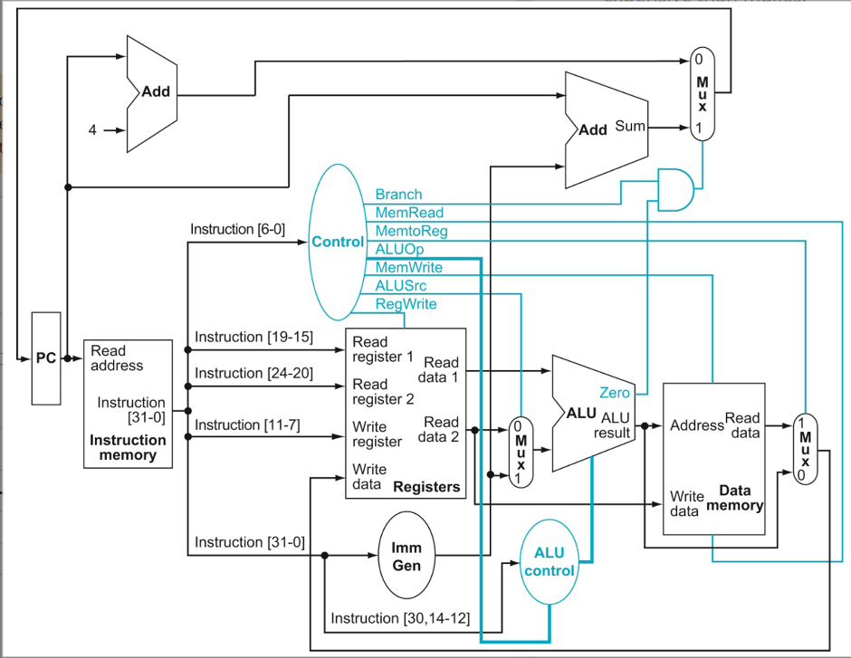

# Lab 11: Computer Organization

Now that you have a grasp of assembly programming, it's time for a deep dive into how these instructions get executed on a microprocessor.  

One of the most important tools used for innovation in the computer architecture space are simulators. Simulators are useful both in research and industry because they help prove whether the assumptions used in contemporary processor design are true. Not just that, but designing a simulator for a processor is a great academic exercise to get well-versed in how it works. Therefore, in this lab, we will be implementing some elements of the simple single cycle processor simulator using C programming.

We will be studying the hardware implementation of a subset of RISC-V instructions, namely `add`, `addi`, `or`, `ori`, `and`, `andi`, `sub`, `lw`, `sw` and `beq`, by having you implement the control logic and immediate generator blocks of the processor in simulation.

In the [accompanying GitHub repo](https://github.com/ece362-purdue/riscv-lab-4), you will start with the following code:

```c
#include <stdint.h>

enum state{
  Unset,
  Zero,
  One, 
  DC
};

struct ControlSignals {
  enum state Branch{Unset};
  enum state MemRead{Unset};
  enum state MemtoReg{Unset};
  uint8_t ALUOp{0b11};
  enum state MemWrite{Unset};
  enum state ALUSrc{Unset};
  enum state RegWrite{Unset};
};

extern void setControl(uint32_t instBits, ControlSignals& outputSignals);
extern uint32_t getExtendedBits(uint32_t instBits);
```

The above code is contained in the header file `lab.h`. As you can see the control signals are listed in the struct `ControlSignals`. Each of these signals is defined as an enum state type and can assume the values `Unset`, `Zero`, `One` or `DC` (i.e., a Don't care). At the start of the program all the signals are initialized as `Unset`, except `ALUOp` which takes a binary value.

## Part A: Setup For Lab
You have been provided a folder called Inst_To_Binary in the repository to get the test binaries for simple examples of RISC-V instructions. Initially, this directory will be empty except for a `Makefile`, `start.S` and `testbin.sh`. In order to generate the binaries for the test instructions, open the folder in the integrated VSCode terminal and type `bash ./testbin.sh`. A number of `.bin` files will be created inside the folder once the script completes. These files are the binaries that will be used to test your code. 

## Part B: Implementing the Control Logic Block (`setControl`)
In this step, you will be implementing the control logic block in the following diagram.



The first function in the lab.cc file is `setControl()`. This is the function you will write your code in to implement your Control Unit. Your task for the first part of this lab is to assign the correct value to the control signals based upon the opcode of the given instructions. For example, in order to assign the control signal `Branch` a value of `One`, you should use the following code inside the function.

```c
outputSignals.Branch = One;
```

> Hint: To find out what the different meanings of the instruction bits can be, refer to the [RISC-V ISA](https://github.com/riscv/riscv-isa-manual/releases/download/Ratified-IMAFDQC/riscv-spec-20191213.pdf) Instruction Set Listings.

> Hint: Don't forget to use don't cares - there are certainly cases where you'll need to use it for some of the output control signals.  For example, store instructions save from registers to memory, so you "don't care" about the reverse direction.  This may not be the case for all control signals - for example, if you're not writing to registers, the register enable must be OFF, not don't care.  When in doubt, **experiment first** to see what values make sense, and then ask on Piazza.

> Hint: AluOP is two bits long, so Zero/One alone may not work for some cases as they are 1-bit values.  

## Part C: Implementing the Immediate Generator (`getExtendedBits`)

Similar to Part A, write your code in the getExtendedBits() function to implement the Immediate Generator. It should take in the 32-bits of the instruction, and appropriately output the **sign extended** portion of an immediate instruction. Use bit manipulation in order to do so.

> Hint: Instructions will not always assign the immediate to the same set of bits.  Check that you're using the correct bits for each of the instructions you'll be testing (see the top of the page again for that list).