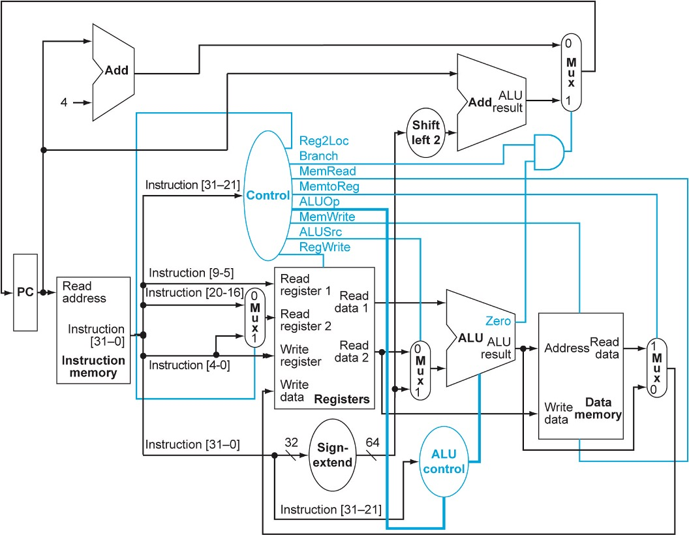

# Lab 4: Computer Organization

In this lab, we will be studying the hardware implementation of a simple, single cycle of a subset of the LEGv8 architecture.

Specifically, we will be implementing some elements of the processor in a C/C++ simulator.
The code for this simulator can be written/run on virtually any linux/mac or windows
system with an appropriate C++ compiler.

Please note that you are able to complete this lab using only standard C (C is a subset of C++)
knowledge, however, we are using two C++ features (for convenience) in the code we have given you.
The first is the definition of a struct. C++ has dropped the versbose requirement that
you must define a struct before referencing it (or create a typedef to avoid doing it).
Therefore; a ```ControlSignals``` instance can be instantiated by simply stating ```ControlSignals a;```

In C you would have had to declare it as a typedef this way:

```C
// C struct
typedef struct {
  uint64_t Reg2Loc;
  uint64_t Branch;
  uint64_t MemRead;
  uint64_t MemtoReg;
  uint64_t ALUOp;
  uint64_t MemWrite;
  uint64_t ALUSrc;
  uint64_t RegWrite;
} ControlSignals;

// Cpp struct
struct ControlSignals {
  uint64_t Reg2Loc;
  uint64_t Branch;
  uint64_t MemRead;
  uint64_t MemtoReg;
  uint64_t ALUOp;
  uint64_t MemWrite;
  uint64_t ALUSrc;
  uint64_t RegWrite;
} ;
```

The other concept is something called "pass by reference", which is used on the ```ControlSignals``` struct
passed into the setControl function:

```CPP
// CPP pass-by-reference
void setControl(uint64_t instBits, ControlSignals& outputSignals)
{
  outputSignals.Reg2Loc = 1;
  ...
}
```

You can think of a ControlSignals& as a pointer where you use the ```.``` operator
to dereference it instead of the ```->``` operator.

So the above code snippet is functionally-equvalent to the following in C:
```C
// C passing by pointer
void setControl(uint64_t instBits, ControlSignals* outputSignals)
{
  outputSignals->Reg2Loc = 1;
  ...
}
```

All you really need to know to use this code is that you should set the fields
of the outputSignals struct like this ```outputSignals.Reg2Loc = 1;```.
And now you can all claim you have coded in C++ ;)
Sidebar: This is really a bare-minimum subset of C++, so don't go telling recruiters that you
"know" C++, or they are going to start asking you about [The Diamond Problem](https://en.wikipedia.org/wiki/Multiple_inheritance),
and you might risk looking silly :)

After you have pulled down the code, building the tester should
just involve running:

```bash
make
```

from the command line. If you want to test this code on your own ARM-based MAC,
use the command:

```bash
make MacArm
```

To run the test for the lab, run:
```bash
./lab4
```

##  Part A: Implementing the control logic [40 Points]

In this step, you will be implementing the control logic block in the following diagram.



Assume that the control unit takes in the 11-bits of the op code and
outputs the set of control signals necessary to implement:
ADD, ADDI, SUB, SUBI, LDUR, STUR, ORR, and CBZ.
Since this is a C simulator and we are not generating real hardware, for "don't care" signals, nothing has to be set.
For the ALUOp line, assume a 2-bit signal with the following meaning:

| Value |         Meaning      |
| ----- | -------------------- |
|  00   |          Add         |
|  10   |        R-Type        |
|  11   | Pass Through data 2  |


##  Part B: Implementing the sign extender [60 Points]

Similar to Part A, write a C-function that implements the Sign-Extender.
It should take in the 32-bits of the instruction, and output the sign appropriate
sign extended portion of the instruction.

## Some helpful hints

- Recall that you can specify hex constants in C using the ```0x``` format and binary constants using the ```0b``` format.
- Be careful with shifting "1". Since we are using large, 64-bit types, C by default will treat a constant "1" as a 32-bit value. If you want to shift the value "1" to set the higher bits in a number by shifting it over (i.e. "1 << 63"), decare "const uint64_t one = 1;", then do "one << 63".
- Recall, not all instructions have the same number of opcode bits, however, your setControl function is always getting the uppermost 11-bits of the instruction in the lowermost 11-bits of instrBits.

Your final points will be calculated based on the percentage of test cases passed
in each category. Please be sure to hand in your lab4.cc file to Bright Space.
