# Lab 5.0: Setting up the Microcontroller
In ECE362, students will learn fundamentals of microcontrollers, including their operation, and usage. In addition to the lecture portion of the course, students are expected to complete a series of lab experiments using a microcontroller platform and IDE. Computers and measurement equipment are provided in the course laboratory facilities to assist students in completing labs, however, the course has also been designed to allow students to perform experiment exercises on their own computers at home or elsewhere. Instructions provided in this lab document serves as a guide to setting up the microcontroller development environment used in ECE362 to provide a consistent user experience between home and the laboratory.

**Make sure that you read this document in full. There are two ways in here to destroy your development board.**

# Step 1: Place the Development Board on a Breadboard
Open your ECE 362 lab kit and find the STM32F091RCT microcontroller development board. It should look like the one in the image below. 


Your ECE Master/Mini kit has a large, four-panel breadboard similar to the one pictured below. Place the devboard so that it is on the bottom of the second panel, shown below:


Typically, these will be a little hard to get in there, but you should not have to remove it once it's in there. To prevent damage to the board, press down on the buttons. Do not apply force to anything else, as parts of the board are delicate and may become damaged. When inserting, make sure there are two holes on either side of the development board to leave room to plug in peripherals.
Next, connect the USB programmer (shiny colored device with a light on it, pictured below) to the devboard.

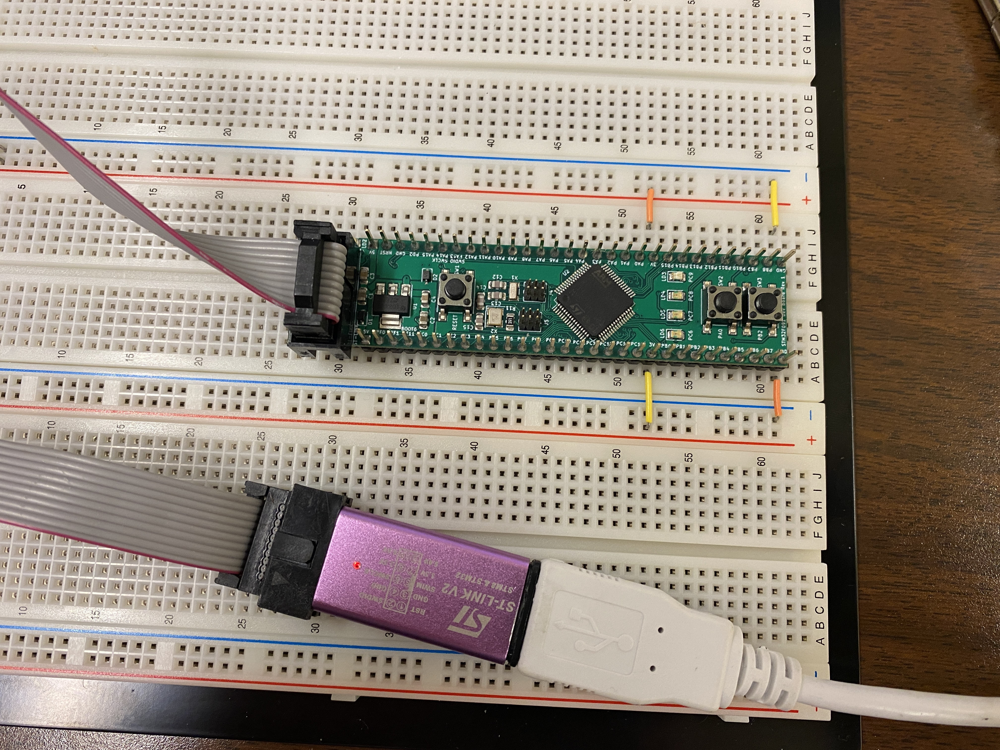

It is important that this programmer only ever gets connected to the black header on the side of the devboard. If you manage to place it on the exposed pins on the long sides of the devboard, you will irreversably damage the development board.
After plugging in the programming side to the devboard , you should see a red and a green LED light up. If it does not light up, unplug the programmer and call over a TA so they can take a look at it.

# Step 2: Install the Development Software
For our course, the Eclipse IDE will be used, alongside of the SystemWorkbench for STM32 plugin. Eclipse is open source, so it may not seem like the most user-friendly when you are first using it. After extended use, you should be able to navigate it pretty well. Here are instructions on how to set it up on your machine, as well as on the lab computers.

## Step 2.1 Installation on the lab computers
Fortunately for you, one of the past instructors created a setup package that you can invoke to (msotly) take care of this for you. Open a terminal window, and invoke this line of code:
```bash
~ece362/bin/setup
```
After running this, you should see new icons appear on your desktop. One of them reruns the setup program, which you can use to update your configuration if any new applications are needed. Another icon is created for System Workbench, which is the main application that you will use.

## Step 2.2: Installation on a Linux system.
The version of Linux that this application is supported on is Ubuntu LTS. It might work on other distributions, or it might not. You can get the installation package [here](https://www.st.com/en/development-tools/sw4stm32.html#get-software). A couple of different ways to install it are located below:

```bash
bash install_sw4stm32_linux_64bits-latest.run
```
or
```bash
sudo apt install lib32ncurses5 make
```
or
```bash
sudo apt install libpython2.7:i386 libncurses5:i386 make
```

Pick the one that works best for your distribution, and keep track of where the installer puts the required folders. These will be important later. The installation script should set up a link on your desktop by which you can invoke System Workbench. If not, invoke it with 

```bash
[the path to the installation directory]/eclipse
```

## Step 2.3: Installation on a Windows System
Eclipse works on Windows 10 and 11. You can find the installation package [here](https://www.st.com/en/development-tools/sw4stm32.html#get-software). Once downloaded, run the installer. Keep track of where the installer puts the required folders. These will be important later. Sometimes Windows may require a driver for the STLink programming device. Download and install the driver, located [here](https://www.st.com/en/development-tools/stsw-link009.html).

# Step 3: Download and Install the Standard Peripheral Library
For this class, we will use the OpenSTM32 Standard Peripheral Library as the core of our work. In a sum, it's a script that starts the chip up, as well as a couple of other scripts that provide memory address acronyms. This is nice because you will not have to constantly look up the memory addresses for each part of the chip, which is a huge pain. You can find it [here](https://www.st.com/en/embedded-software/stsw-stm32048.html#get-software), or cached on the Brightspace.

**NOTE:**  I cached a renamed version on the Brightspace now, so you no longer have to mess with the version or rename it. Simply drop the zip file into the Firmwares folder, and extract it into the same folder. You should have **two** copies: one zipped, and one unzipped.

Once downloaded, moved the zip file into the their repective directory. If you chose the default locations, typically they're located in:
```bash
.ac6/SW4STM32/firmwares
```
for Linux, or
```bash
C:\Users\<username>\AppData\Roaming\Ac6\SW4STM32\firmwares
``` 
for Windows. 

For the lab machines, you need to enable the ability to view hidden files, as having the dot in front of ac6 makes it a hidden file. You can do this by selecting the view tab on the file explorer, and checking the box that says "show hidden files." 

Move the zip file into the firmwares directory, and unzip it inside of that location. None of use are really sure why, but Eclipse looks for both the zipped and unzipped version. They must have the same name, otherwise Eclipse will pretend like it's not there. If you download an earlier or later version than V1.5, you may have to rename it to V1.5, as shown in section 5.4 of this document. None of us really know why, but Eclipse sometimes only likes V1.5. It might also only look for one specific naming covention, like the one shown below. If all else fails, try naming both of your files like this:

```bash
stm32f0_stdperiph_lib_v150
stm32f0_stdperiph_lib_v150.zip
```

This is what your Firmwares folder should look like after:

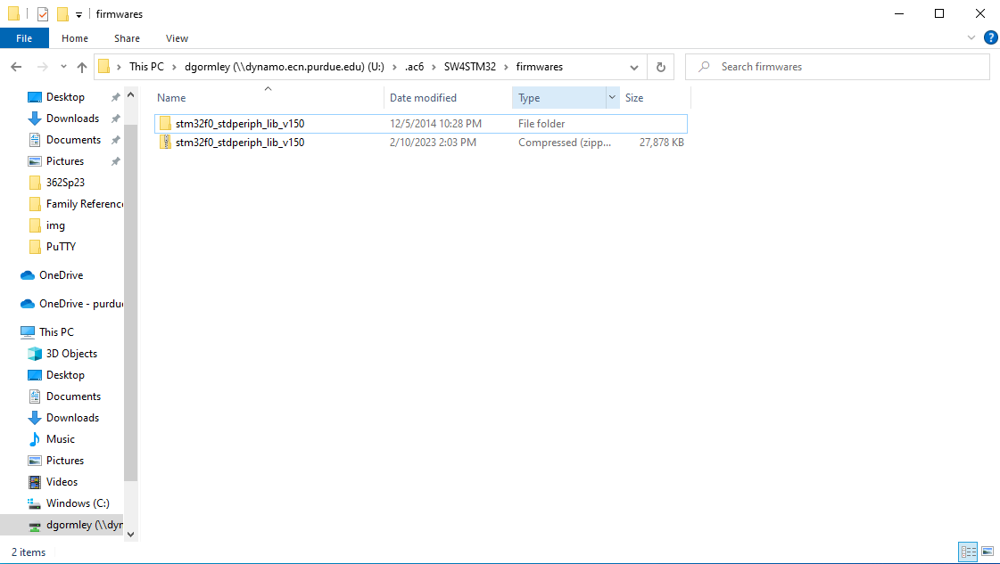


# Step 4: Configure SystemWorkbench
Now that the software is installed, we can begin configuration. Start this by selecting the "Window" dropdown at the top of the screen, and selecting the "Settings" option. As you're doing this, make sure that you're changing the settings highlighted with the red Xs.

## Step 4.1: General Workspace Preferences
Here, we configure the general workspace preferences. Open the "General" dropdown, and select "Workspace." Here, unselect "build automatically" and select "Save automatically before build." After, change your text file encoding to UTF-8, and new text file line delimiters to Unix. This helps standardize what you and the TAs look at, and enables a setting to build the correct version of your project, as Eclipse only builds the last-saved version. An example setting is shown below:

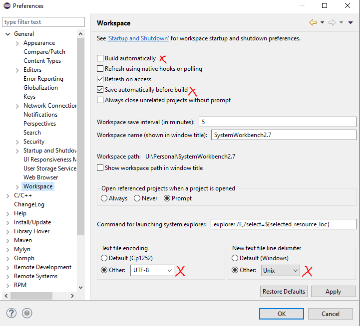

## Step 4.2: General Text Editor Preferences
Next, drop down the "Editors" tab, and select "Text Editors." Check the "Show print margin" tab so you can see where the printer would stop in case your code ever needs to be printed out. An example setting is shown below:

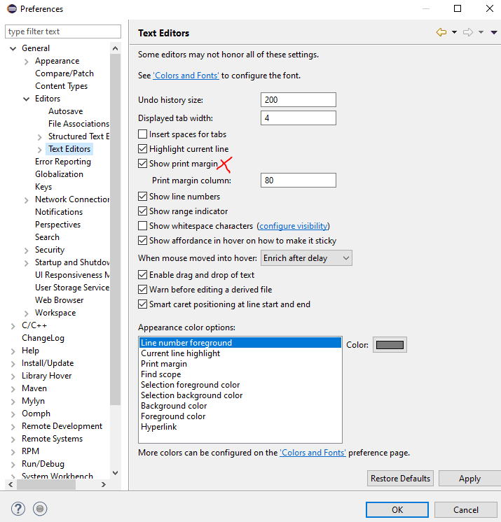

## Step 4.3: C/C++ indexer Preferences
Open the "C/C++" dropdown, and then select "Indexer." Make sure "Use active build configuration" is checked. An example setting is shown below:

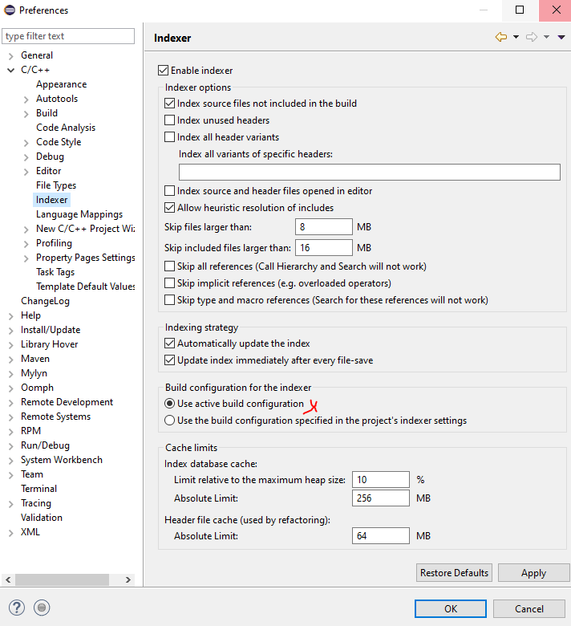

## Step 4.4: C/C++ Code Formatting Settings
Eclipse, like other IDEs, automatically formats code for you. However, it needs to be told to not use tabs. Open the "C/C++" dropdown, open the "Code Style" dropdown within it, and then select "Formatter." Select "New" to open a new template, and select "K&R C" as your base. Make sure to select "Spaces only" for your tab policy. Past that, you're free to format your code however you want. Make sure you save and apply after. An example setting is shown below:

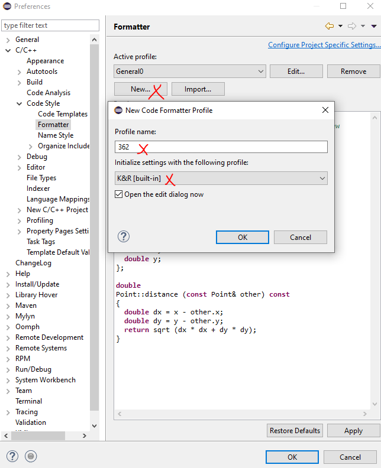

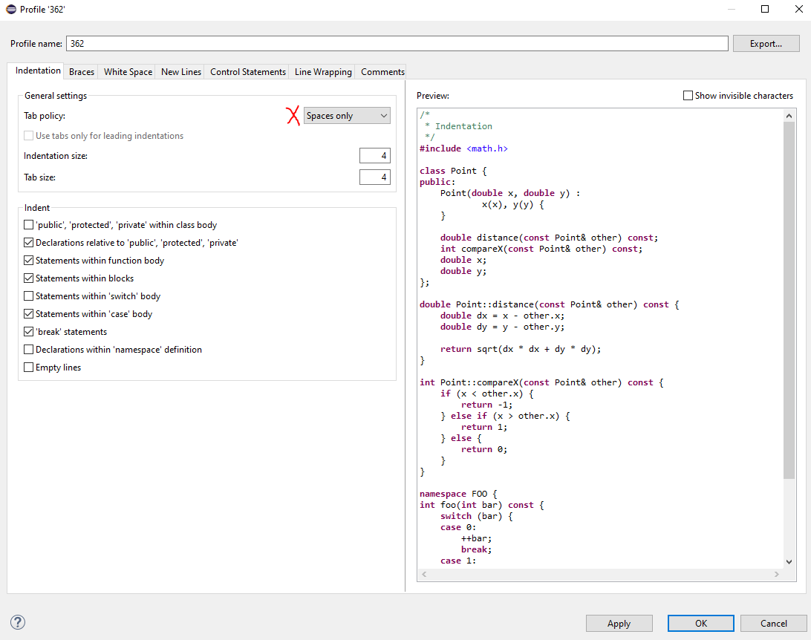

## Step 4.5: Build Console Settings
Open the "C/C++" dropdown, then the "Build" dropdown within it. Then select the "Console" tab. In there, check "Bring console to top when building (if present) and "Wrap lines on the console." These make sure that the build console is present, as well as ensuring that the console is visible if you have it open. After, increase the number of lines to something larger. I typically use 5,000, as it's atypical for a program of our nature to print anything larger than that. An example setting is shown below:

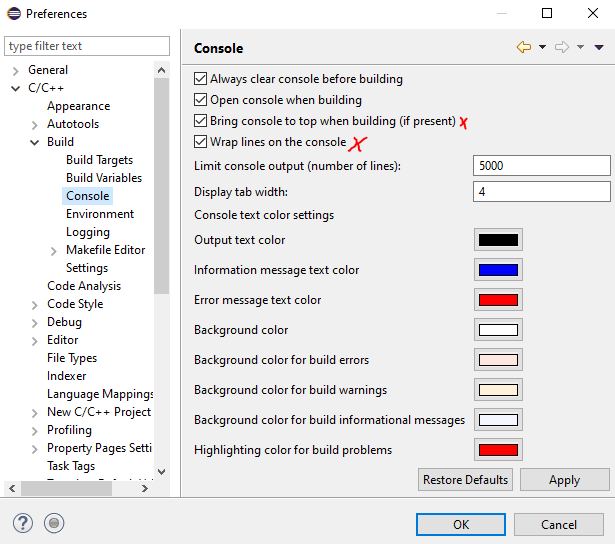

# Step 5: Creating a Project in SystemWorkbench
Time to test out our configuration! Ensure that your Devboard is plugged into the computer, and restart SystemWorkbench, then follow these instructions.

## Step 5.1: Creating a New Assembly/C Project
At the top of the screen, open the "File" dropdown. Select the "New" option, and then select the "Project" button. In the opened "Select a Wizard" dialog box, select "C project" and then hit "Next"

![NewProj}(./img/img10.PNG)

## Step 5.2: C Project Dialog
Select the "Ac6 STM32 MCU Project" button, and enter a project name as "Test," as this will be your test project to make sure the chip works as intended. Hit "Next." On the next "Select Configuration" dialog, just press "Next."

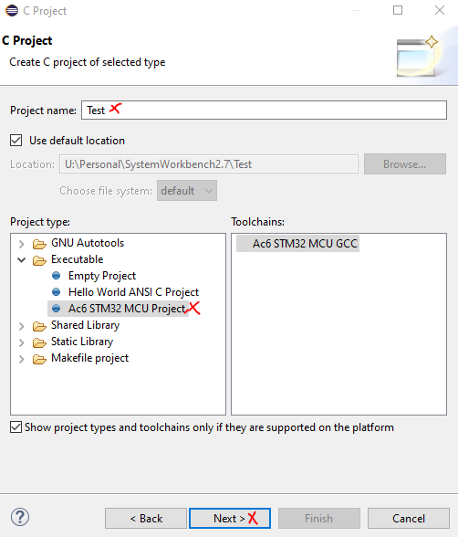
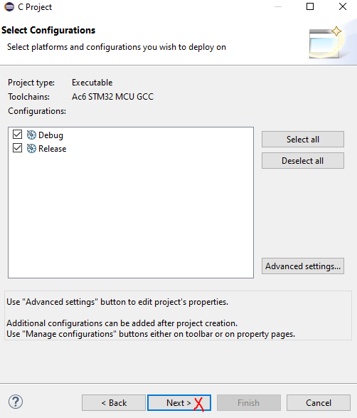

## Step 5.3: Target Configuration
Select the "MCU" tab at the top of the window. After, ensure that the "Series:" dropdown contains the STM32F0. After, you'll need to select the specific model of microcontroller, so that it knows which peripherals to load in. Ours is the STM32F091RCTx, which is located near the bottom of the dropdown menu. After, don't hit "Finish," hit "Next."

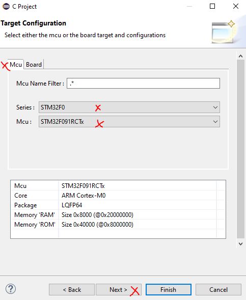

## Step 5.4: Firmware Selection
Select "Standard Peripheral Library (StdPeriph)." It will look for the standard peripheral library that you had installed earlier. This may take a few moments, as these files are quite large and it likes to verify them each time they get opened. Do not use the "Cube HAL" option, or the "No firmware" option. Cube HAL is still a work in progress from STM, and no firmware means that you'll need to manually program in a startup sequence and memory locations (which, for our purposes, you really don't want to do. For those of you that asked, the no firmware setting is bare-metal programming).

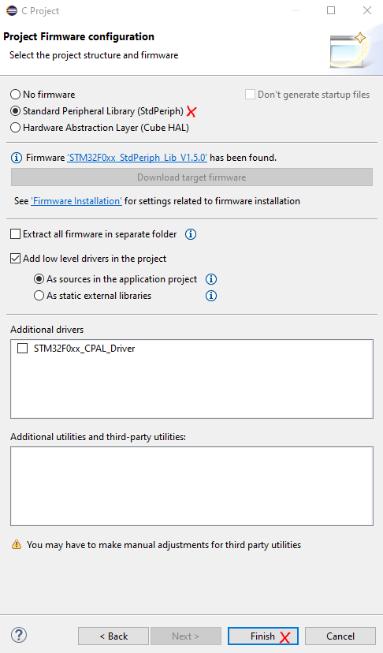

After this, it should find your SPL. If it doesn't, refer to section 3 of this manual to make sure that you did it correctly. If it's still not working, call a TA over. Click "Finish," and the wizard will go about automatically creating your project.

# Step 6: Edit, Build, and Debug a Project
Inside of your project, there will be a few top level directories. Here's what they contain:
- Binaries: Compiled modules for your project.
- Includes: Global headers will appear here.
- inc: A separate includes folder for you to place your own .c header files.
- src: The folder where the project's source files should be located.
- startup: The folder that contains the startup files for the STM32F091. These are all .s files. Inside of here, you can also find the memory definition files in case you need to look anything up. For example, an ISR in the later parts of the course.
- Debug: the folder that will contain the debuggable version of your compiled program.
- LinkerScript.ld is the file that tells the linker where to put any segments of the executable for your precompiled program.

## Step 6.1: Editing a Source File
Double-click on the src folder to open it, and then double click on main.c to edit it. It'll open the editor window, which will take up the majority of your screen. This is where you can write and edit code. When creating this new project, it should've filled in an infinite for loop in the main file, as well as a commented header. 

There is a very similar build/save/run interface at the top of the window that you might recognize from the ARM IDE used earlier in the class. Go ahead and click the hammer icon in the top left to build the project. There's not much to build, so this should go by pretty quickly and without any hangups. 

## Step 6.2: Debug Configurations
To get the debugger running correctly, click the "Run" dropdown at the top of the screen, and then the "Debug Configurations" button just below the middle of the dropdown. In the "Create, manage, and run configurations" dialog that appears, double click the "Ac6 STM32 Debugging" option that appears on the left sidebar. This opens a new debug configuration.
After, rename this configuration to the project's name, and then use the "search project" button to find your .elf file that was generated by the build. Make sure you click "Apply" to save your changes. 
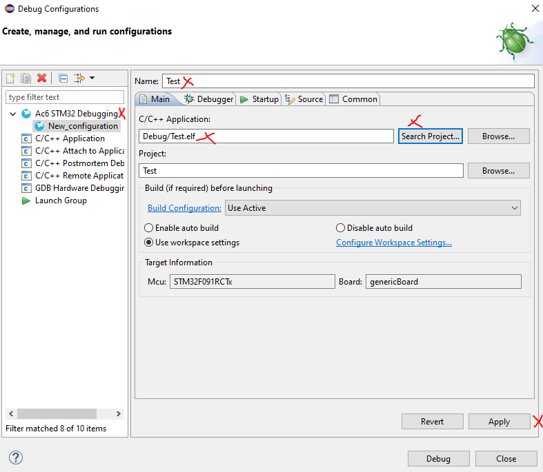

Next, which is probably the most important part, is to select the "Debugger" tab. This brings you to debugger-specific settings. One of these settings is generated incorrectly for our application, and must be changed each time. You can get to this setting by selecting "Show Generator Options" and then changing the Reset Mode from "Connect under reset" to "Software System Reset," like shown below:

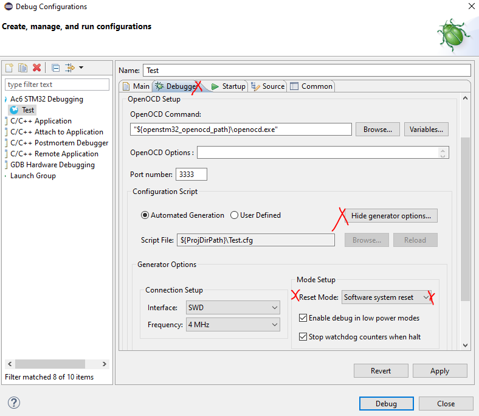

This will reset each time you make a new debug configuration, which will happen each week. If you do not change this, you will get a message saying that the microcontroller will not connect. This is typically why. If you're curious, your debugger is not a real STLink. It's a cheap knockoff that our supplier makes, but they work well enough, and they reduce the kit costs by around $30.

## Step 6.3: Debugging a Program
Lets try debugging a program! First, clear out your main file, and enter this instead:

```C
#include "stm32f0xx.h"
      
int main(void) 
{
    int x = 0;
    int y = 0;
    for(;;) 
    {
        x += 1;
        y -= 1;
    }
}
```
After, click the blue bug at the top of the screen. This will rebuild your project and prompt you to switch into Debug Mode. Click yes, and it'll change your screen in a few different ways, like shown below:

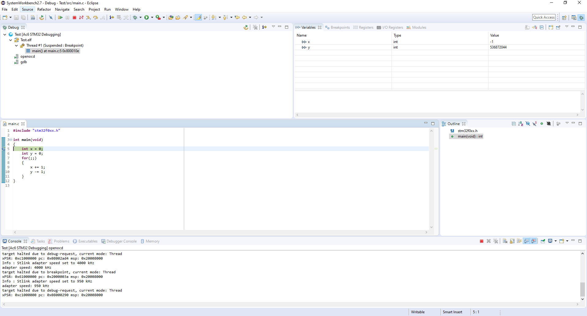

The console is now the bottom of the screen, the editor is the bottom-left pane, and there are multiple useful memory/register tools located in the top-right pane.

Here is a breakdown of the debug tools located at the top of the window:

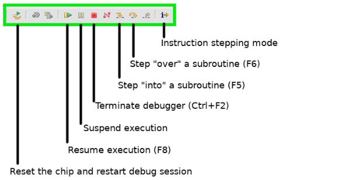

You'll also note that the light on the debugger will start blinking. This is normal, and shows that it's in normal operation. At this point, you can explore what each button does. Specifically, the different step over/into buttons. You will have a prelab later to explore these functions in more depth.

## Step 6.4: Demonstrate Your Debugger
Call over a TA, and demonstrate that your debugger is working, and show them what each button does. They will check you off for this step if you can.

# Step 7: Setup and Interact With a Serial Port
Begin with terminating the debugger. Switch bag into "editor" view by clicking the button to the left of the bug on the top right corner of the debug window. Copy and paste this code into your main.c file:

```C
void setup_serial(void)
{
    RCC->AHBENR |= 0x00180000;
    GPIOC->MODER  |= 0x02000000;
    GPIOC->AFR[1] |= 0x00020000;
    GPIOD->MODER  |= 0x00000020;
    GPIOD->AFR[0] |= 0x00000200;
    RCC->APB1ENR |= 0x00100000;
    USART5->CR1 &= ~0x00000001;
    USART5->CR1 |= 0x00008000;
    USART5->BRR = 0x340;
    USART5->CR1 |= 0x0000000c;
    USART5->CR1 |= 0x00000001;
}
int main(void)
{
  setup_serial();
  while(1)
  {
     if((USART5->ISR & USART_ISR_RXNE))
       {
         USART5->TDR = USART5->RDR;
       }
  }

}
```

This code segment has the STM32 "listen" for inputs on the serial terminal, and echo them back. Essentially, if you use the terminal, it'll replicate characters that you press on the terminal so you can see them. If you run a blank piece of code and try to type on the terminal, it'll stay blank.

## Step 7.1: Wiring the Serial Port
Do these things:
- Check and make sure the serial adapter (red board, pictured below) is set to 3.3V mode, because if it's not, it'll immediately destroy your devboard when plugged in. You do this by moving the jumper (orange, yellow, or black cap on the pins) to the 3V position, which is the right-most two pins. Before you plug this in, call a TA over and make sure it's on the correct position.
- Place the pins of the serial adapter into the breadboard.
- Connect Rx (Pin 2) of the serial adapter to PC12 of the devboard.
- Connect Tx (Pin 3) of the serial adapter to PD2 of the devboard.
- Connect GND on the devboard to the breadboard's ground rail (blue).
- Connect GND (Pin 6) of the serial adapter to the breadboard's ground rail (blue).
- Connect CTS (Pin 5) of the serial adapter to the breadboard's ground rail (blue).

Some example pictures:

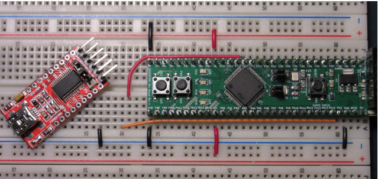

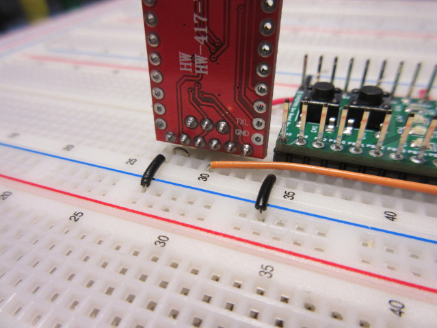

After this is wired properly, check one last time to make sure the adapter is in 3V mode. Then, connect the adapeter to your computer with the USB cable in your lab kit.

## Step 7.2: Turning on the Serial Monitor on the Lab Machines
Open your terminal, and enter in this command:

```bash
screen /dev/ttyUSB0 115200
```

Your terminal should go blank. After, instead of the debug button, click the green "Run" symbol to the right of the bug symbol. This programs your microcontroller and runs your code. Then, click back to your terminal and try typing some things. You should see the terminal show whatever characters you have typed.

## Step 7.3: Turning on the Serial Monitor on Your Personal Machine
On your personal computer, download and install a program called TeraTerm. It's an open-source serial terminal. After installation, open it. You should see a dialog like the one shown below. Select "Serial Port," and then find the "USB Serial Port" option. It does not have to be COM5, so long as it knows as it's a USB serial port.

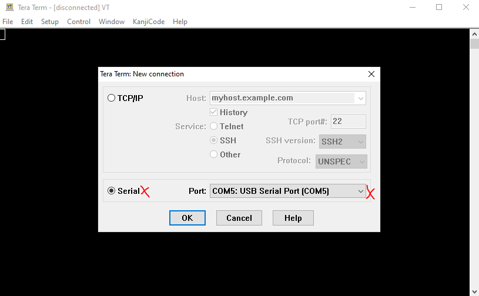

After, click the "Setup" dropdown, and click the "Serial Port" option. Ensure that the port that's selected is the COM port that the serial port defaults to. Then, change "Speed" to 115200. Click "OK."

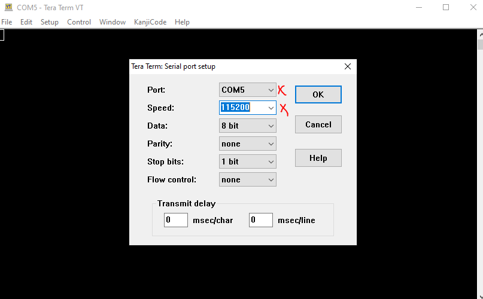

After, instead of the debug button, click the green "Run" symbol to the right of the bug symbol. This programs your microcontroller and runs your code. Then, click back to your terminal and try typing some things. You should see the terminal show whatever characters you have typed.

## Step 7.4: Demonstrate Your Serial Port 
Call over a TA and show them that your serial port is working. This constitutes the last checkoff.
