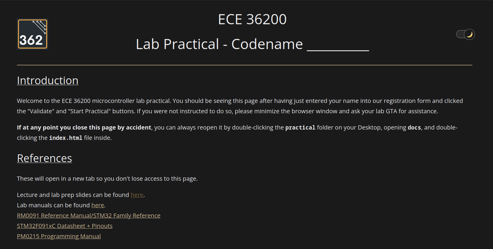

# The ECE 36200 Lab Practical

## Introduction
This document aims to demystify anything and everything about the lab practical - its administration, the infrastructure involved, and most importantly for you, how to prepare for it.  

It is our hope that providing all this information removes the stress that is typical of exams, and allows you to focus on being prepared to tackle any task that we may give you.

## What is going to happen in my lab section the week of the lab practical?

### Summary
The lab practical will be 2 hours long and will require you to implement a design by configuring a small subset of peripherals (about 2-3) on the STM32 microcontroller you have been using the past 8 labs.  Show up to your lab section on time.  We may need a bit of time to set up the lab machines and STM32 test breadboards (which will be thoroughly checked and not have any wiring issues) for the practical.  The process involves signing into a test account on which we will set up SystemWorkbench and the instruction manual for your specific practical.

### Office Hours
Except for Monday, there will be **no office hours** in the week of the practical (Tue - Thu) to ensure the integrity of the lab space.  Please direct any and all questions to Piazza.

24x7 lab access will also be revoked for the week of the practical, so please do not enter the lab without prior authorization.

### At the beginning of your lab section...
Try to show up early to your lab section, please wait outside until a lab GTA walks out and lets you know that the lab is ready for you to come in.  You will then be asked to line up, put all electronic items on your person into your bag.  If you have a physical Purdue ID, you may keep that with you, but for digital IDs, show that to your lab GTA before you enter your lab and then immediately put your phone in your bag.  Paper and pencil will be provided if you need it.  **Silence your phone and any other audible devices before you enter.**

Your TAs will indicate the designated space where your bag goes, and you will be told which station to go to.  Enter and sit at your station quietly, as there may be students already in the section who are taking their practical.  Your station will have a **LabPractical** program open with instructions on what to do - please read it carefully, and do not touch the mouse or keyboard yet.  Wait until all students have been seated, and watch for the lab GTA to give you the signal to start.  

### During the practical
You will then enter your username into the application, click Validate, which will confirm your identity and save it, and enable the button that will allow you to start the practical.  Clicking this will close the application, and open SystemWorkbench with a configured workspace and a web browser with the instruction manual webpage.  Drag the windows to your liking, and follow the instructions on the webpage to do the practical.  

### Doing the practical

The STM32 will be fully wired up with all the devices you may need for the practical.  Your focus will be on writing the code in SystemWorkbench, and hitting Run/Debug to flash it to the STM32.  

The practical is arranged as steps (similar to your lab experiments), with points and expected behavior for each step.  In the event that you cannot complete a step, you do not need to indicate it to your TA - simply do the best you can, and leave your computer as is.  Your TAs will assign partial credit based on the **correctness of the work** you will have done so far.  

If you need a number converter, you may use the in-built calculator on Ubuntu - it comes with a programming mode that allows you to convert between bases.  Press Start and type `calculator` to bring it up.

### Heisenbugs/Unexplainable Technical Phenomena
Your data is saved on persistent storage even if the computer somehow freezes or crashes, so even if we have to forcibly restart the machine, you should be able to pick up where you left off when we set it up again.  We'll give you extra time if that rare situation happens.

The webpage will contain its own instructions, links to all reference material, and a step-by-step guide on what to do for your specific practical.  Read the instructions carefully, use the reference material as needed, and implement the design as per the steps in SystemWorkbench.  You should be able to build/run/debug the STM32 and see the results of your code on the test breadboard.  

If you are stuck with anything technical, you may ask the lab TAs for help, but keep in mind that the TAs will be instructed to not give you any hints or help you in any way.

### Once you are finished...
Raise your hand so that a TA can come over and confirm the functionality of your code on your STM32.  The instruction manual will tell them what to check for.  Your TA will perform an evaluation based on the circuit, tell you your score, and record it.  At that point, follow the instructions to end the practical, pick up your belongings, and leave the lab quietly.

If you did not manage to finish the practical on time, type a comment into your code with your username, leave your lab station as it is, and exit the lab quietly.  

## What will I be tested on?
The practical will be limited to configuring the same peripherals you have been using the past 8 weeks.  If something isn't familiar, look through the associated lab manual to refresh your memory.  Use that to identify the portions of the datasheet to look at for a specific peripheral and its function.

- GPIO (All labs)
    - Choosing purpose of a pin in MODER
    - Pull-up, pull-down in PUPDR
    - Configuring alternate functions in the AFR
    - EXTI interrupts for input pins
- Timers (Lab 3-6)
    - PWM on Timer 1 (Lab 5)
    - Trigger interrupt when TIM->CNT rolls over to 0
        - Eg. basic ISR or DMA, which leads us to:
    - How to calculate PSC and ARR given a frequency
- DMA (Lab 4)
    - Configuring DMA to transfer data for mem2mem, mem2periph, or periph2mem
        - Direction bit determines this (mem2periph or periph2mem)
    - Specifying memory/peripheral data sizes and locations
        - Sizes: 8/16/32 bits
        - Locations: msg array to DAC->DHR12R1, or ADC->DR to msg array
    - Increment/not increment memory/peripheral location addresses
        - Peripherals have only one register, whereas memory locations are arrays
        - Or, you may transfer multiple datums to/from a single memory location
    - Specifying number of elements to transfer.
        - For single elements, this is 1
        - For arrays, this is the length of the array
    - Trigger interrupts on half/complete/errored transfers
    - Enabling circular transfers
        - Repeats the transfer when enabled
- ADC (Lab 4)
    - Find the associated pin, which must be configured as analog in MODER
    - Turn on 14 MHz clock in RCC
    - Wait on clock to be ready
    - Turn on ADC with ADEN bit in ADC->CR
    - Wait for ADC to be ready
    - Select corresponding channel for pin in the CHSELR
    - Wait for ADC to be ready... again!
    - You can assume the default configuration of right-aligned 12-bit conversion.
    - In associated ISR:
        - Start ADC with ADSTART in CR
        - Wait until EOC is set
        - Read ADC1->DR to get values. (boxcar/print code will be given.)
- DAC (Lab 4)
    - Set up pin as analog
    - Set up associated timer to write values to DHR12R1 (right-aligned 12-bit) register
    - Fairly straightforward as we'll give you the code for conversions anyway.
- SPI (Lab 6)
    - Use this to communicate with the OLED display
    - Set up pins as alternate function
    - Disable SPI enable **before** configuring it
    - Selecting the baud rate using BR (we'll tell you what to set it to, you need to find the bits to change)
    - Selecting data size using DS (we'll tell you what to set it to, you need to find the bits to change)
        - Be very careful! Do not reset full register, only the bits you want to reset.
    - Enable TX empty/RX not empty interrupts
    - Enable DMA request to transmitter and from receiver
    - Only then do you enable SPI.
- UART (Lab 7)
    - Configure pins for alternate function
    - Disable UART first
    - Set word length, parity, stop bits, and oversampling
    - Set baud rate as per Table 96 of the Family Reference manual
    - Enable TX and RX with TE and RE bits
    - Only then do you enable UART.
    - Then wait for TE/RE to be acknowledged by waiting for TEACK+REACK bits to be set in ISR.
    - Configure interrupts on RXNE (we received data) and TXE (data was sent)
- And finally, good ol' RCC (All labs)
    - Enabling/disabling clocks for peripherals - always the first thing to do!

As well as the following "concepts", not necessarily tied to a specific peripheral:
- Configuring registers
    - RCC, SYSCFG/EXTI, NVIC, peripheral-specific registers
    - Knowing when to set/clear certain bits, or assign to the whole register.  Two examples are:
        - Clearing individual bits by doing `SPI->CR2 &= ~(SPI_CR_DS_2 | SPI_CR_DS_1)`, not all the bits at once with `SPI->CR2 &= ~SPI_CR_DS`, otherwise the DS bits will be set to 0111.
        - Knowing that `NVIC->ISER = 1 << 6` is safe since writing a 0 does not affect the other bits, but this is a rare case.
- Interrupts
    - Enabling/disabling interrupts
    - Setting priorities
    - Finding the names of, and then implementing, ISRs
        - And then acknowledging those interrupts
    - Enabling/disabling interrupts in the NVIC
    - For EXTI interrupts, unmasking in the IMR and setting bits in the RTSR can be tricky.  Practice by picking any pin configured as input, and setting up an EXTI interrupt for it.

## How do I practice for the practical?
There's a lot of content to cover, which is why it is worth reminding you that configuring a peripheral should **not** require you to memorize how to configure it.  It's about **knowing where to look for the information you need to configure it**.  This is why we will provide you with the following:

- The lecture slides to understand the theory behind the peripheral.
- The lab prep slides to give you a starting point on how to configure the peripheral.
- The lab manuals, if you want a reminder of what you were told to do to configure the peripheral, as well as any warnings that we may have given you when it came to configuring it.
- The reference manuals, so that once you know what registers to set for a peripheral, you can look up what values to set them to.

**As much as possible, do not practice using tools on the Internet (eg. Google, ChatGPT)** - you will not have access to it during the practical, and the purpose of the practical is to test **your** ability to configure peripherals based on the given datasheets, not those tools.

### Form a *process* for figuring out how to configure a peripheral

To set up a mock practical, take a lab you've already done, and see how much time you can do it in without asking for help, and making use of only the resources that will be given to you in the practical (no Internet, no past code, and most importantly, no other individuals).  If it takes longer than your allotted practical time at this point, you need to determine a **process** for using the tools at your disposal to quickly learn what you need to do to configure a peripheral, and then practice that process so you can do it quickly.  Here's an example of such a process in the worst case.

Let's say you have some random peripheral, RAND.  You did a lab in which you configured RAND to send data out on pin PC1, and receive data on PC2.  You see it again in the practical, and you're told that you need to echo back the data you receive on PC2 back out on PC1.  In general for any peripheral, you need to know how to set up the peripheral first, i.e. filling out some init_rand() function, so that it can be used to transmit/receive data.  
    
Your first resource may be the lab manual for the lab in which you used RAND, or the lab prep slides which may have example code you can use.  Ideally, it may have the bullet-by-bullet instructions for what to do to configure RAND, but in the less-than-ideal situation that it only tells you how to configure RAND but not enable interrupts, then we need to consider the other resource, i.e. the lab prep slides if you used the lab manual, or vice-versa.  
    
Now that we have the list of instructions on what to do, we need to determine how to translate it into code.  This is where the reference manual comes in.  It will tell you what registers to set, and what values to set them to (and in a rare case, how to set it).  Your knowledge of how to clear/set bits correctly should help you here.  If you don't remember what the name of a certain macro was, Ctrl-Click on any of the defined macros and use Ctrl-F to find it. 
- For example, RCC_APB2ENR_SYSCFGCOMPEN is too long to remember off the top off your head, so just remember COMPEN, and then Ctrl-F for it in `stm32f0xx.h` when you need it.

<video src="finddefs.webm" width="1000" height="auto" controls preload></video> 

 

- Bits corresponding to a peripheral are usually named after the peripheral, so if you need to find the bits for RAND, Ctrl-F for RAND in `stm32f0xx.h` and you should find it. 
    - An example is the Data Size register of SPI_CR2, which is named SPI_CR_DS_2, SPI_CR_DS_1, and SPI_CR_DS_0.  You can find these by Ctrl-F for some combination of SPI, CR2 and DS in `stm32f0xx.h`.  (Remember that SPI, not SPI2, may be in the macro name.)

Now that our code is written and implemented, we give it a try by running it on the STM32, and inevitably nothing happens.  This is where debugging comes in.  First do a thorough visual inspection of the code you've written so far, looking for things like:
- Misplaced OR/AND/equal signs in register assignments
- Mixing up macro assignments to registers, eg. you ORed RCC_APB2ENR_SYSCFGCOMPEN into RCC_APB1ENR.
- Not enabling clocks for peripherals in general.
- In cases of UART/SPI, disabling the peripherals before configuring them.
- Not enabling interrupts in the peripheral and/or NVIC.
- Making sure you have the right name for your ISR by simply copy-pasting it from the relevant file - do not risk it by typing it out from memory.

Then, use the debugger to check that values are being set when you set them.  An example of something you can catch this way is the SPI data register - if you set it all to 0, that's an invalid value, forcing the bits to get set to 0111, so you should make sure to reset only the bits you want, not all at once.  

## Anything else you'd like to be covered?

If you'd like us to check your process and offer advice, ask if anything is covered/not covered on the practical, or any other such questions, please ask on Piazza - we may update this document with an FAQ section if we get enough of the same questions.  
