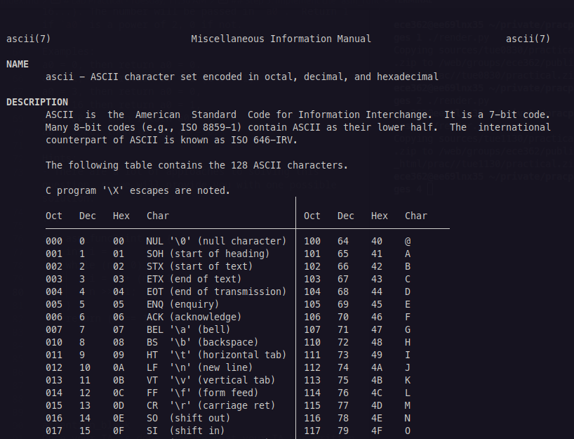
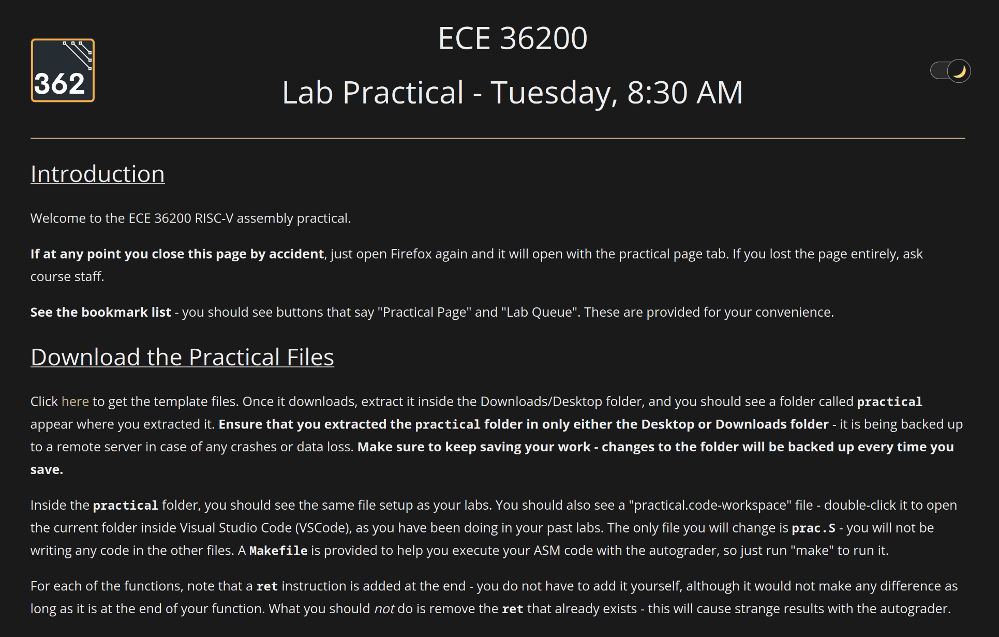

# The ECE 36200 RISC-V Assembly Exam/Practical

## Introduction
This document aims to demystify anything and everything about the RISC-V practical - its administration, the infrastructure involved, and most importantly for you, how to prepare for it.  

It is our hope that providing all this information removes the stress that is typical of exams, and allows you to focus on being prepared to tackle any task that we may give you.

## What is going to happen in my lab section the week of the lab practical?

### Summary
The lab practical will be 2 hours long and will require you to implement three functions in RISC-V assembly, in a similar fashion to the labs that you have been doing all semester.  The first/second functions will be a bit of a warm-up to the second/third ones, which will be longer and possibly involve branching and stack manipulation.

### Office Hours
Thanks to the heroic efforts of our TAs, there will be office hours as usual in the week of the practical (Mon - Thu).

### Piazza
Posts on Piazza during this week will be limited to instructors to ensure no accidental leaking of practical details.  (In general, you are expected not to share any details about the practical with your peers before everyone has taken it.) 

### Do I need my lab kit/Will UART be on this practical?
No.  This practical will only test your ability to translate programs to RISC-V assembly, and will not include any material from the embedded systems portion of the class.

### What materials will I have to work with?
Lecture slides will be provided, but no lab manuals for this one.  You will also have access to the RISC-V "green" card/reference card.

For some functions where you need to manipulate strings and need to know the ASCII code for characters, you can type `man ascii` into a terminal (yes, it comes included on Linux).



### At the beginning of your lab section...
Show up early to your lab section, and wait outside until a lab GTA walks out and lets you know that the lab is ready for you to come in.  You will then be asked to line up, put all electronic items on your person into your bag.  If you have a physical Purdue ID, you may keep that with you, but for digital IDs, show that to your lab GTA before you enter your lab and then immediately put your phone in your bag.  Paper and pencil will be provided if you need it.  **Silence your phone and any other audible devices before you enter.**

Your TAs will indicate the designated space where your bag goes, and you will be told which station to go to.  Enter and sit at your station quietly, as there may be students already in the section who are taking their practical.  

You won't need paper/pencils, but if you would like it anyway, ask one of the TAs as you enter.

### During the practical
While you are seated at your station, your TAs will explain what you need to do to start the practical environment.  **Any attempt to do the practical outside of this environment, or accessing this environment outside of your designated lab section, will get you a zero.**  Follow the instructions given to set up your environment, but **do not start** unless you have been told to.

Once all students have the practical manual and VScode pulled up, your GTA will allow you to begin.



### Doing the practical
You will only work in one file - `prac.S`.  The file will have the definitions for the three functions you are expected to implement.  You will be provided the same Makefile you had in labs, with an autograder that will run your code and give you a score.  Running `make` will run the autograder, same as your labs.

### How will the autograder work?
Similar to your labs, an autograder object file will be provided to be compiled with your `prac.S` file.  Running "make" will automatically run the autograder with your code, and the output format may look something like this:

```
==============  Test results  ==============
asm_func1: x/x
asm_func2: y/y
asm_func3: z/z
=============================================
```

### What if I need a base converter?
If you need a number converter, you may use the in-built calculator on Ubuntu - it comes with a programming mode that allows you to convert between bases.  Click the shortcut on the left sidebar, or press Start and type `calculator` to bring it up, and press Ctrl-Alt-P to switch to programming mode.

### Do I need to write the entire file from scratch?
You'll be filling out some functions in `prac.S`, but you will be given a template with the function names and comments already filled out.

You do not need to worry about `main` functions or any C code - all of that is included in your autograder.  Your focus will be on implementing the assembly functions in `prac.S`.

We'll provide comment blocks so you know where to put each function's code.

### Heisenbugs/Unexplainable Technical Phenomena
The practical infrastructure rewrite involved adding a mechanism where the code is now being backed up to a local git server.  If the machine does crash or have other issues, we will be able to restore your code to the last commit.  You do not need to do anything to configure this - it happens automatically - but what you need to do is ensure that **you are working on your code only in the Desktop or Downloads folders**.  If you are working on your code in any other folder, **your code will not be backed up**, and you will lose it if the machine crashes.

If you are stuck with anything technical, you may ask the lab TAs for help, but keep in mind that the TAs will be instructed to not give you any hints or help you in any way.

### Once you are finished...
Once you have finished implementing the functions, run `make` to ensure you are passing all the individual test cases, and raise your hand.  A TA will come over to run `make` again and note down the scores.  Each function corresponds to a step on their (digital) checkoff sheet.  **Before you leave, make sure that the TA has recorded the correct scores for you** - there will be a link at the end of the practical to let you confirm that your scores have been saved.

If it is past time, and you got a zero on a function, your TA will evaluate your work so far and give you partial credit.  If you did no **meaningful** work whatsoever, you will get a zero.

**In doing this practical, you are expected not to share any details about the practical with your peers before everyone has taken it.  Sharing any details will be considered academic dishonesty.  This is to ensure a fair lab practical experience for everyone.**

## What will I be tested on?
The purpose of this practical is to test your ability to go from a plain description of what function you are implementing, what arguments you are given (as function arguments in registers a0-a7), and what the expected return value for that function is.

Labs 8-10 serve as the references for which the practical will be based on.  Concepts-wise, this practical will cover:
- Basic assembly
    - Arithmetic instructions 
        - Should be pretty straightforward.
    - Bitwise/logical operations
        - Should be pretty straightforward.
    - Memory access with loads/stores
        - What does `lw` do?  What does `sw` do?  (Remember that the "direction" of data transfer is such that `lw` loads from memory into a register, and `sw` stores from a register into memory.)
        - What does 0(x10) mean?  What does 4(x10) mean?
- Control flow (branching, loops)
    - How do you set up a loop/if-else in assembly?
    - What approach uses less instructions for simplicity?
    - Understand `beq`, `bne`, `blt`, `bge`.
        - You do not always have to implement the same condition in ASM - you could check the inverse of the condition and jump to a different part of the code if that is true.
    - How do you do an unconditional loop?
- Functions (stack manipulation, calling conventions, return values)
    - How many bytes do you need to add to the stack pointer (sp) to allocate space for a given set of variables?
    - How do you save registers to the stack?
        - Do you *need* to save all registers, or just the ones you need to use in the function?
    - When calling functions in assembly, save your return address and function arguments (if not already saved).
    - How do you restore registers from the stack?

## How do I practice for the practical?
As a starting point, go back through the examples covered in the labs, and try to implement them without using Copilot, ChatGPT, a compiler, or the various easy-to-use websites that convert C to RISC-V assembly.  It is extremely easy to take the hard work that goes into your compilers for granted with all these tools, so try to work without them.

Your questions *may not* give you the equivalent C code - you will be given a description of what the function does, what arguments it takes, and what the expected return value is.  One approach is to write the C code for the function to better understand how it should work, and then translate that to assembly - much like a compiler.

While you are practicing, don't just focus on the *right* method - focus on the *optimal* method.  Less lines of assembly can make it easier to keep track of different sections of code.

Go over the following resources for some pointers on how you can tackle some question types:
- [Looping](https://ece362-purdue.github.io/f2022-public-labs/common_problems/looping.html)
- [Using the Watch panel and break-on-value](https://piazza.com/class/lliv2m1345130g/post/738)

**Make yourself familiar with the debugger** - it is your helper through unexpected return values and seg faults.  You can use it to step through your code and see what is happening at each step, as well as what values are in each register and memory location.  

Keep in mind that the debugger console might "hide" the output of the autograder + your program, so make sure to switch back to the terminal output (see the end of the video):

<video src="output.webm" width="950" height="auto" controls preload></video> 

## Anything else you'd like to be covered?

If you'd like us to check your process and offer advice, ask if anything is covered/not covered on the practical, or any other such questions, please ask on Piazza - we may update this document with an FAQ section if we get enough of the same questions.  
